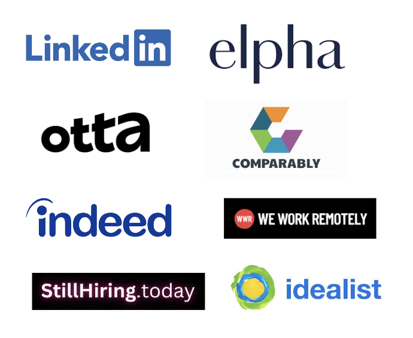
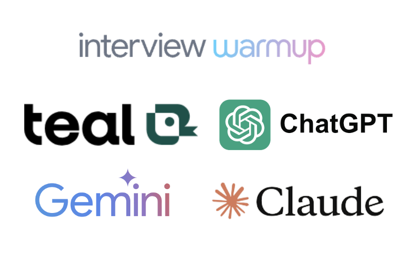

# Job Search Toolkit

## Job Search Sites

## AI Tools

## More AI Tools
* [ResumAI](https://www.resumai.com/): Get your resume written and formatted
* [ResumeWorded](https://resumeworded.com/): Optimize your LinkedIn profile with AI
* [Rezi](https://www.rezi.ai/): Optimize, format and write your next resume using this tool
* [Simplify.jobs](https://simplify.jobs/): Autofill job applications to save time
* [Teal](https://www.tealhq.com/): Track all you job applications in one place
* [Secta Labs](https://secta.ai/): Generate professional headshots with AI
* [Ramped](https://www.rampedcareers.com/): Auto apply to jobs based on your profile
* [CareerFlow.ai](https://www.careerflow.ai/): Track job applications, and optimize LinkedIn profile
* [Kickresume](https://www.kickresume.com/en/): Build a resume using AI and find matching jobs
* [Massive](https://usemassive.com/): Analyze every aspect of a company before apply
* [Tryiton.ai](https://www.tryitonai.com/): Turn your normal photos into a professional headshot
* [LoopCV.pro](https://www.loopcv.pro/): Mass apply to jobs want by uploading your CV
* [Hiration](https://www.hiration.com/): Get your resume scanned and optimized
* [Big Interview](https://www.biginterview.com/): Get actionable step-by-step training on interviews
* [Wave.ai](https://www.wave.ai/): Your personalized career coach powered by AI

