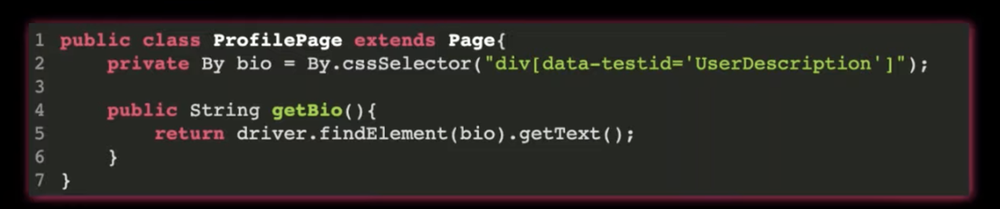

# Automation Concepts

## Automation Objective

- Design a test suite that is fast, gives you confidence, and is not more expensive to maintain than the value it brings.
- Move failure detection as close to the developer as possible
- Increase the speed of running tests. Aim for CI to take less than 10 minutes. Full test suite should take less than an hour.

## What is the Test Pyramid?
https://martinfowler.com/articles/practical-test-pyramid.html

## What is a POM?
A page object is an object representing a webpage or component. They have locators for finding elements as well as interaction methods.

## What type of tests you can automate?
* Unit Tests: Validate single functions, classes or modules of your applications.
* Acceptance Tests: Validate features and benefits your applications provide to their clients.
* Integration (Service) Tests: Validate interplay of your applications and their end to end service flows.
* Performance and Stress Test: Validate how your services scale (or don’t scale) with expected and unexpected client loads. This is particularly important for the most frequently used services.
* Non-Functional Tests: To validate security, availability, capacity and scalability.
If you and your team find it difficult to automate unit and acceptance tests, but heavily rely on automation of integration (service) tests, probably you have tightly couple architecture. You should identify ways to decouple elements of your architecture.

Ref: https://www.devops-certification.org/Why_Do_You_Need_Test_Automation_In_Your_DevOps_Organization.php

## **Which Types of Test Cases Should Be Automated?**

Start automating the most valuable tests to least valuable tests.

**Make a Score Card to Prioritize Which Tests to Automate**

- Is this something on the critical path or something that's frequently used?
- Do we require to actually test this because there's a legal issue?
- Is there a lot of data and environmental setup?
- Is this something that has a lot of reuse?

Tally up the scores and that will tell you which tests will provide the most value when automated. By creating the scorecard, you prioritize tests. The highest value ones get automated first.

**Apply Insights from Marketing Data**

You can also use marketing data to help drive automated tests. Keeping in mind what the customer is doing and how they're interacting with our application is key to us being successful.

- The most popular devices people use.
- The most popular browsers people use.
- The most common flows that people take through applications.
- Points where people jump off of applications because the user experience wasn't great.

This allows us to focus our testing on the people that drive our business by using the most popular devices.

## HOW TO CREATE A TEST AUTOMATION FRAMEWORK FROM SCRATCH? 
* Blog Post: https://angiejones.tech/how-to-build-an-agile-friendly-automation-framework/
* Video: https://www.youtube.com/watch?v=e7c_tq6mAEU
* Code: https://github.com/angiejones/automation-framework

## Which test cases offer the highest ROI for automation?:
* Deterministic – Scenarios that have standard results where we know that X input may only result in Y output. 
* Repetitive / Regression - Test cases that are repetitive & relatively unchanging and going to be tested all the time / most of the time.
* Data driven scenarios - where same function needs to be validated with lots of different data such as using different countries or using different employment status and roles

When creating a software automation script, several factors should be considered when choosing tests for automation:

1. **Test Suitability:**
   - Assess the stability and predictability of the test case. Tests with consistent and reliable outcomes are ideal for automation.

2. **Frequency of Execution:**
   - Prioritize tests that are executed frequently during the development lifecycle or regression testing. Frequent execution justifies the investment in automation.

3. **Complexity of Test Cases:**
   - Evaluate the complexity of test scenarios. Complex test cases with numerous steps or data variations are often good candidates for automation.

4. **Repetitive Tasks:**
   - Automate repetitive and monotonous tasks that are prone to human error. Automation can improve accuracy and efficiency in executing such tasks.

5. **Stability of the Application:**
   - Consider the stability of the application under test. If the application is still undergoing significant changes, focusing on automation may not be practical until the software stabilizes.

6. **Test Data Management:**
   - Analyze how test data is managed. Automation is particularly beneficial when dealing with large sets of data or when executing tests with different data permutations.

7. **Time and Resource Constraints:**
   - Assess time and resource constraints. Automation can be time-consuming initially, so it's essential to balance the effort against the expected benefits, especially in time-sensitive projects.

8. **Maintainability:**
   - Evaluate how easily the automated tests can be maintained. Choose tests that are likely to remain relevant and require minimal updates as the software evolves.

9. **Return on Investment (ROI):**
   - Consider the overall return on investment. Prioritize tests that, when automated, offer significant time savings, reduce manual effort, and enhance overall testing efficiency.

10. **Collaboration and Communication:**
    - Ensure effective communication and collaboration between the development and testing teams. Choose tests that can be easily integrated into the continuous integration/continuous deployment (CI/CD) pipeline.

By taking these factors into account, you can make informed decisions about which tests to automate, optimizing the efficiency and effectiveness of your software automation script.

----------------------------------------------------------------
# Object Oriented Programming in Automation

[Webinar | Applying Object Oriented Programming Principles to Test Automation Design with Angie Jones](https://www.youtube.com/watch?v=cb-FgYMMbNE&t=4s)

## Pillars of OOP: 
A PIE → Abstraction, Polymorphism, Inheritance & Encapsulation

## Encapsulation:
Private data + Public data to expose public methods


### What is POM?

Modelling a class to represent a single page for AUT.

Contains properties/data/elements that represents elements from a page, and methods that interact with those methods.

Keep elements private and publicize the methods that access the elements

Test Classes shouldn't engage with the elements itself but only the methods.



Private → Strictly Family

Protected → Friend & Family (within same package or children classes)

Public → Obviously public

## Inheritance:

- Parent, Child relationship
- extend data and behaviour


### More Inheritance


## Polymorphism

- The ability to take multiple forms
- Example: Using for WebDriver with different type of browsers


## Abstraction

- Provides templates to be implemented; Used as blueprint
- Methods doesn't contain any implementation


----------------------------------------------------------------

# Element Locators

[Locators](https://automationintesting.com/selenium/java/lessons/locators.html)

[Xpath in Selenium with All Tactics and Examples [2021 Guide]](https://www.swtestacademy.com/xpath-selenium/)

[Web Element Locators for Test Automation](https://automationpanda.com/2019/01/15/web-element-locators-for-test-automation/)

## **Absolute XPath in Selenium**

- It is a direct way to locate an element.
- It is very brittle.
- Starts with a single slash “/” which means starting to search from the root.

**Example:** */html[1]/body[1]/div[2]/div[2]/main[1]/div[1]/section[1]/div[1]/div[1]/div[1]/div[1]/div[2]/div[1]/div[1]/h1[1]/strong[1]/span[1]*

### **Relative XPath in Selenium**

- Starts from the middle of the HTML DOM.
- Starts with a double slash “//” which means it can start to search anywhere in the DOM structure.
- Shorter than Absolute XPath.
- Less fragile.

**Example:***//span[text()=’About Software Test Academy’]*

# **Writing Smart XPaths for Complex and Dynamic Elements**

### **Tag – Attribute – Value Trio**

**Syntax: //tag[@attribute=’value‘]**

**Example = //img[@alt=’Onur Baskirt‘]**

```bash
//input[@type='send text']
//label[@id='clkBtn']
//input[@value='SEND']
//*[@class='swtestacademy'] --> "*" means, search "swtestacademy" class for all tags.
//a[@href='http://www.swtestacademy.com/']
//img[@src='cdn.medianova.com/images/img_59c4334feaa6d.png']
```

### **Contains XPath in Selenium**

It is a very handy XPath Selenium ****locator and sometimes it saves the life of a test automation engineer. When an attribute of an element is dynamic, then you can use contains() for the constant part of the web element but also you can use contains() in any condition when you need.

**Syntax: //tag[contains(@attribute, ‘value‘)]**

**Example:** //img[contains(@alt,’Baskirt’)]

```bash
//*[contains(@name,'btnClk')] --> It searches "btnClk" for all name attributes in the DOM.
//*[contains(text(),'here')] --> It searches the text "here" in the DOM.
//*[contains(@href,'swtestacademy.com')] --> It searches "swtestacademy.com" link in the DOM.
```

### **Starts-with Xpath Examples**

This method checks the starting text of an attribute. It is very handy to use when the attribute value changes dynamically but also you can use this method for non-changing attribute values.

**Syntax: //tag[starts-with(@attribute, ‘value‘)]**

**Example:** *//img[starts-with(@alt,’Onur Ba’)]*

### **Chained Declarations XPath in Selenium**

We can chain multiple relative XPath declarations with **“//” double slash** to find an element location as shown below. We chained “//div” with “*//span[text()=’About Software Test Academy’]’ in the below example.*

**Example: *//div//span[text()=’About Software Test Academy’]***

## Operator “or” in Xpath Selenium

**“or” is case-sensitive**, you should not use a capital “OR”.

**Syntax: //tag[XPath Statement-1 or XPath Statement-2]**

```bash
Syntax: //tag[XPath Statement-1 or XPath Statement-2]

Example: //*[@id=’user-message’ or @class=’form-control’]
```

## Operator “and” in Xpath Selenium

**“and” is case-sensitive**, you should not use the capital “AND”.

```bash
**Syntax: //tag[XPath Statement-1 and XPath Statement-2]
Example:** *//*[@id=’user-message’ and @class=’form-control’]*
```

### **How to find XPath by Text**

We can find an element with its exact text.

**Syntax: //tag[text()=’text value‘]**

**Example:***//span[text()=’About Software Test Academy’]*

### **Ancestor Xpath Examples**

It finds the element before the ancestor statement and sets it as a top node and then starts to **find the elements in that node**. In the below example,

1- First, it finds the element whose XPath is *//section[@id=’content’]*

2- Then, starts to find all div elements in the node where the above XPath belongs to.

**Example**: *//section[@id=’content’]//ancestor::div*

### **Following XPath Selenium Examples**

Starts to locate elements **after the given parent node**. It finds the element before the following statement and sets it as the top node and then starts to find **all elements after that node**. In the below example,

1- First, it finds the this XPath with class attribute: **//div[@class=’fusion-sliding-bar-wrapper’]**

2- Then, starts to find all section elements after that node.

**Example**: *//div[@class=’fusion-sliding-bar-wrapper’]//following::section*

### **Child XPath in Selenium Examples**

Selects all children elements of the current node.

**Example**: *//nav[@class=’fusion-main-menu’]//ul[@id=’menu-main’]/child::li*

### **Preceding XPath Examples**

Select all nodes that come before the current node. I give an example on swtestacademy. We will find all “li” elements on the About page. First, we will locate the bottom element, then use preceding with “li” to find all “li” elements as shown below.

**Example**: *//div[@id=’wrapper’]/div[@class=’fusion-sliding-bar-wrapper’]//preceding:*

### **Following-sibling XPath Examples**

Select the following siblings of the context node.

**Example**: *//*[@class=’col-md-6 text-left’]/child::div[2]//*[@class=’panel-body’]//following-sibling::li*

### **Descendant XPath Examples**

Identifies and returns all the element descendants to the current element which means traverse down under the current element’s node. Below, the XPath returns all “li” elements under the “menu-main”.

**Example**: *//nav[@class=’fusion-main-menu’]//*[@id=’menu-main’]//descendant::li*

**Parent XPath Examples**

Returns the parent of the current node as shown in the below example.

**Example**: *.//*[@id=’get-input’]/button//parent::form*

----------------------------------------------------------------
Screen captures from my [Udemy course](https://www.udemy.com/course/road-map-to-become-test-automation-engineer)


----------------------------------------------------------------

# Automation Engineer: Skill Set/Capabilities

1. A testing mindset - must have good analyzing skills to understand what needs to be covered as test scenarios

2. Programming skills

3. Ability to implement object oriented programming principles

4. Software architecture skills

5. In-depth understanding of automation concepts such as:

○ Page Object Model

○ [Test Pyramid Model](https://martinfowler.com/articles/practical-test-pyramid.html)

○ [Test Trophy](https://kentcdodds.com/blog/write-tests/)

○ The inverted test pyramid

○ Test data management

○ Continuous integration

○ The separation of tests and framework

○ Reporting and test tracking

○ Distributed/parallel testing

○ Test case management (volume, suites, stability, etc.)

○ Helper/utility mechanisms for common tasks such as database access/querying, service layer access, etc.

6. Awareness of automation patterns & anti-patterns

- Ice cream cone testing (https://testing.googleblog.com/2015/04/just-say-no-to-more-end-to-end-tests.html)

"Ice cream cone testing" is the anti-pattern where the most expensive, fragile, non-deterministic tests are prioritized over faster and less expensive deterministic tests because it "feels" right.

7. Awareness of different testing tools and techniques to be able to make best recommendations

8. Report Handling

9. Testing and automation experience on accessibility, SEO, performance tests

10. Involvement in testing activities out of work

- Reading Blogs

- Discussion on Social Media (LI, FB, Twitter)

- Testing Conferences

- Testing Training Classes

- Testing Meetups

- Reading Articles / Books on Testing

- Crowd Testing

- Other

11. Strong knowledge about Quality & Agile practices

12. Knowledge about DevOps practices

13. Good understanding about managing testing/automation strategies

# KSA (Knowledge, Skills & Abilities Chart)

If user has mentioned skill set, mention the tools used & candidate score (How would you score yourself)

1. Functional Testing

2. Automated UI Testing

3. Automated API Testing

4. Mocked Data

5. Mocking / Mocked API

6. Automated Performance Testing

7. Automated Accessibility Testing

8. Automated SEO Testing

9. Independent system component testing using stubs

10. Continuous Integration / Continuous Testing

11. Docker / Containerization

12. What you want to learn/explore

13. Awareness about concepts: Automation Pyramid, Inverted Pyramid, AI tools, Visual Testing.


# Resources:
- [What Are the Types of Automation Testing?](https://www.testim.io/blog/what-are-the-types-of-automation-testing/)
- [Webinar | Applying Object Oriented Programming Principles to Test Automation Design with Angie Jones](https://www.youtube.com/watch?v=cb-FgYMMbNE&t=4s)
- [Deciding the Need for Automated Test Cases](https://www.perfecto.io/blog/types-of-test-cases-to-automate)
- [Test Pyramid](https://martinfowler.com/bliki/TestPyramid.html)
- [The Practical Test Pyramid](https://martinfowler.com/articles/practical-test-pyramid.html)
- [Testing Pyramids & Ice-Cream Cones](https://watirmelon.blog/testing-pyramids/)
- Locators:
   - https://automationintesting.com/selenium/java/lessons/locators.html
   - https://www.swtestacademy.com/xpath-selenium/
   - https://automationpanda.com/2019/01/15/web-element-locators-for-test-automation/ 
