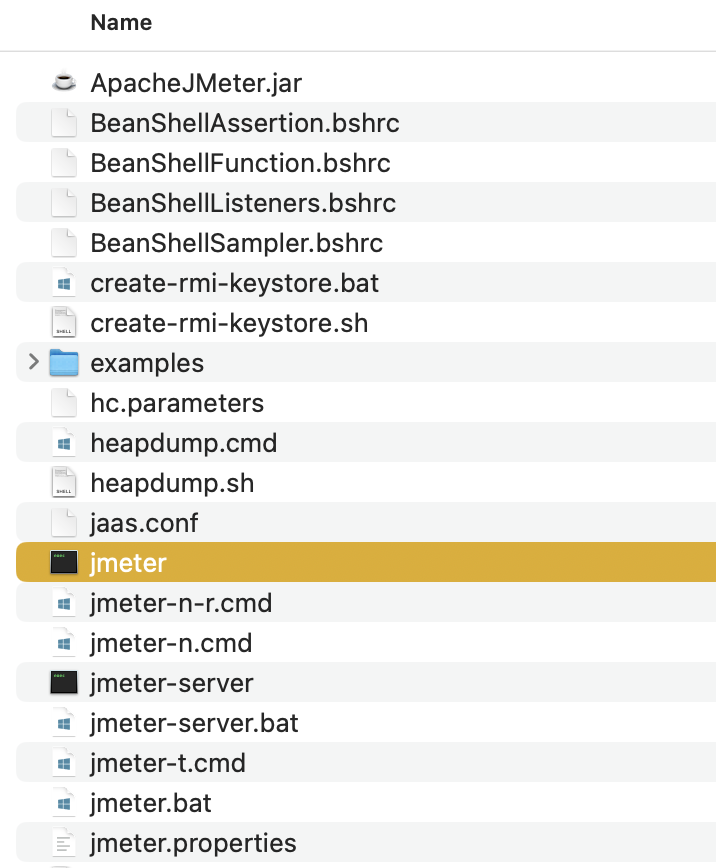

# Performace Testing

## What is performance testing?
* Performance testing is a type of software testing that evaluates how a system performs under specific conditions, such as workload, stress, or load. 
* The goal of performance testing is to assess the speed, responsiveness, stability, and scalability of a software application or system.
* Performance testing helps identify bottlenecks, performance issues, and areas for optimization to ensure that the system meets performance requirements and user expectations.

There are several types of performance testing, including:

1. **Load Testing:** This type of testing evaluates the system's ability to handle a specific load or number of concurrent users. It helps determine the system's behavior under normal and peak load conditions.

2. **Stress Testing:** Stress testing assesses the system's behavior when it is subjected to extreme conditions, such as high traffic, data volume, or resource utilization. It aims to identify the breaking point or the point at which the system fails under stress.

3. **Scalability Testing:** Scalability testing evaluates how well the system scales up or down to accommodate changes in load or resources. It helps determine the system's ability to handle growth or increased demand without significant performance degradation.

4. **Endurance Testing:** Endurance testing, also known as soak testing, assesses the system's performance over an extended period under normal load conditions. It helps identify any performance degradation or issues that may occur over time, such as memory leaks or resource exhaustion.

5. **Spike Testing:** Spike testing evaluates the system's ability to handle sudden spikes or bursts of traffic or load. It simulates scenarios where there is a rapid increase in user activity to assess how the system responds and recovers.

Performance testing is crucial for ensuring the reliability, stability, and optimal performance of software applications, especially in environments where high availability and responsiveness are critical, such as e-commerce websites, financial systems, and enterprise applications.

Absolutely! Here are a few example interview questions about bottlenecks and optimization, along with sample answers showcasing how to use your performance testing knowledge:

## How do you identify performance bottlenecks in a system?

**Sample Answer:**

 "I use a methodical approach:

* **Metrics:** Start by analyzing performance metrics (response time, throughput, resource usage) to pinpoint where the slowdown is occurring (frontend, backend, database, network).
* **Profiling:** For code-level bottlenecks, use profilers to see where the application spends most of its time (slow functions, inefficient algorithms).
* **Monitoring Tools:** Explore system-level monitoring (CPU, memory, disk I/O, network traffic) for resource constraints.
* **User Journeys:**  Identify critical user flows and break down performance by individual steps to find pain points.

It's also crucial to collaborate with developers to understand the application's architecture and potential areas of concern."

## Describe a time you optimized a piece of code or a system for performance.

**Sample Answer:**

"In a previous project, we noticed slow response times on a core user dashboard. Profiling revealed the issue was a database query with inefficient joins. I worked with the development team to:

* **Add Indexes:** Optimized database performance by adding appropriate indexes.
* **Query Refactoring:** Re-wrote the query to be more efficient, reducing unnecessary data fetches.
* **Result Caching:** Added a caching layer (Redis) for frequently accessed data, reducing database load.

These changes led to a 60% response time improvement, significantly enhancing the user experience."

## How does performance testing fit into your overall QA strategy?

**Sample Answer:**

"I see performance testing as vital to ensure a positive user experience. I advocate for:

* **Early Integration:** Performance baselines as part of the development process, not just before release.
* **Shift-Left:** Encourage developers to write performant code and consider performance in design decisions.
* **CI/CD:** Include performance tests in the CI/CD pipeline to quickly catch regressions.
* **Proactive Monitoring:** Track performance trends in production to predict issues before they become critical."

**Tips:**

* **Specificity:** Replace placeholders like 'previous project' with a real example if possible.
* **Data-Driven:**  Mention specific metrics (e.g., "reduced response time from 5s to 2s") to quantify your impact
* **Collaboration:** Emphasize working with developers, it's rarely a solo QA effort.

## What makes JMeter a popular load testing tool?
Apache JMeter is a popular open-source tool for load testing and performance testing of web applications, web services, and other resources. Several factors contribute to its popularity:

1. **Open-Source:** JMeter is open-source software distributed under the Apache License, making it freely available for use and modification by the community. This openness fosters collaboration, continuous improvement, and customization to meet specific testing needs.

2. **Versatility:** JMeter is versatile and supports various protocols such as HTTP, HTTPS, FTP, JDBC, SOAP, REST, JMS, LDAP, and more. This versatility allows testers to perform a wide range of load testing and performance testing scenarios across different types of applications and services.

3. **User-Friendly GUI:** JMeter provides a user-friendly graphical user interface (GUI) that simplifies test creation, configuration, and execution. Testers can easily design test plans, set up test scenarios, configure samplers, add listeners for result analysis, and manage test scripts through the GUI.

4. **Scalability:** JMeter is capable of distributed testing, allowing testers to scale load tests across multiple machines and servers to simulate realistic user loads and distribute the workload effectively. This scalability is crucial for testing applications that require high concurrency and performance.

5. **Rich Set of Features:** JMeter offers a rich set of features for load testing, including thread groups, controllers, samplers (HTTP requests, FTP requests, JDBC requests, etc.), timers, assertions, listeners (graphs, tables, trees, etc.), and pre-processors/post-processors. These features enable comprehensive load testing and performance analysis.

6. **Plugins and Extensions:** JMeter supports plugins and extensions that enhance its functionality and extend its capabilities. Users can leverage plugins for specific protocols, custom samplers, reporting enhancements, and integrations with other tools and frameworks, enhancing the tool's flexibility and usefulness.

7. **Active Community Support:** JMeter benefits from a large and active community of users, developers, and contributors who provide support, share knowledge, contribute plugins/extensions, and collaborate on improving the tool. This community-driven ecosystem fosters innovation and ensures ongoing development and support for JMeter.

Overall, JMeter's combination of open-source nature, versatility, user-friendly GUI, scalability, rich features, plugins/extensions, and community support makes it a popular choice for load testing and performance testing in various software testing environments.

## How to install JMeter?
1. Navigate to https://jmeter.apache.org/download_jmeter.cgi
2. Download binaries for your operating system.
3. Extract the binary.
4. From extrated folder, go to bin, and run JMeter.

**:point_right: Check my notes about the [JMeter](https://github.com/SoftwareTestingTrends/quality-engineering-career-curator/blob/main/notes/performance-testing/jmeter.md) tool.**

