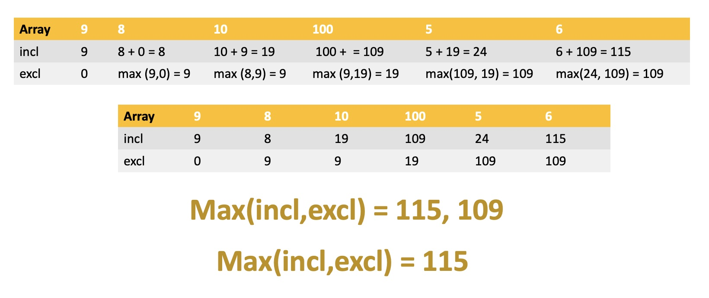
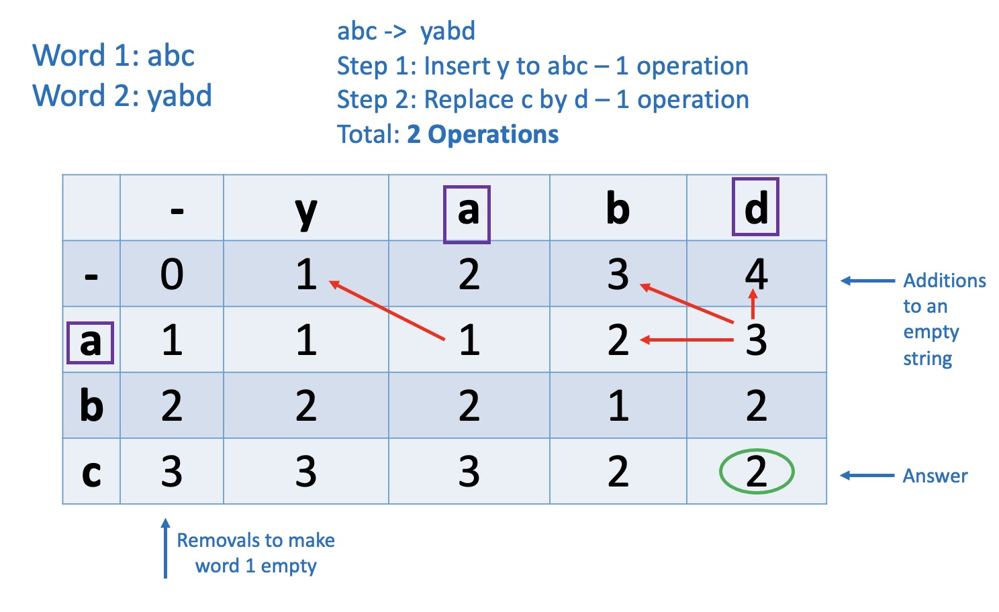
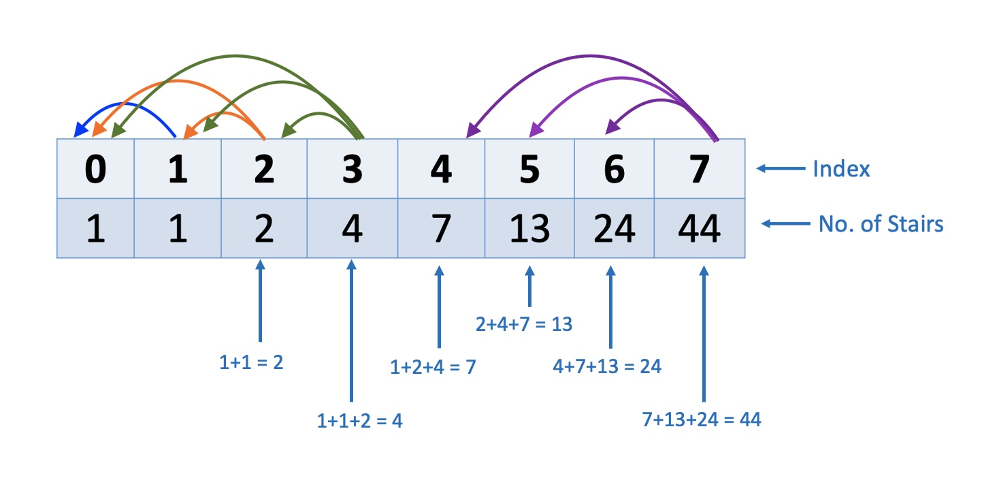
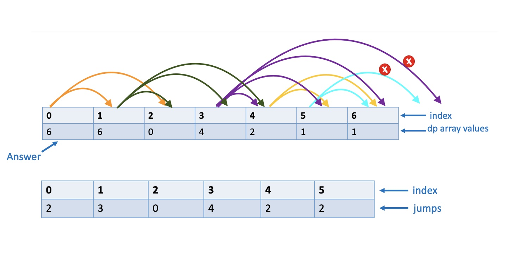

# Strings
# ▪️ Reverse a string
Return a string that is reverse of the original string.
```js
//Using JS built-in function
function stringReversal1(string){
    return string.split('').reverse().join('')
}

//Without using built-in method
function stringReversal2(string){
    let reversedStr = ''
    for(let char of string){
        reversedStr = char+reversedStr
    } 
    return reversedStr
}

const string1 = 'testing'
const string2 = 'Trends!'
console.log(stringReversal1(string2))
console.log(stringReversal2(string2))
```
## Complexity
* Time complexity: O(n)
* Space complexity: O(1)

# ▪️ Palindromes
* Determine if a string is a Palindrome. Note that Palindromes are strings that form the same word if the strings are reversed in order.
```js
const isPalindrome1 = (string) => {
  return string === reverse(string);
};

const reverse = (string) => {
  return string.split("").reverse().join("");
};

const isPalindrome2 = (string) => {
  let stringArr = string.split("");
  let leftIdx = 0;
  let rightIdx = string.length - 1;
  while (leftIdx < rightIdx) {
    if (stringArr[leftIdx] !== stringArr[rightIdx]) return false;
    leftIdx++;
    rightIdx--;
  }
  return true;
};

const string1 = "abba";
const string2 = "abcdefg";
console.log(isPalindrome1(string1));
console.log(isPalindrome2(string1));
console.log(isPalindrome1(string2))
console.log(isPalindrome2(string2))
```
# ▪️ Integer Reversal
* Given an integer, return an integer that is the reverse of original number.

```js
const integerReversal = num => {
   return parseInt(num.toString().split('').reverse().join('')) * Math.sign(num)
}

console.log(integerReversal(189))
console.log(integerReversal(-189))
```

# ▪️ Max Characters
* Given a string, return the character that is most commonly occurs in the string. 

```js
const maxChar = (string) => {
  const charMap = {};
  let maxCount = 0;
  let maxChar = "";
  createCharMap(string, charMap);
  console.log("charMap: ", charMap);
  for (char in charMap) {
    if (charMap[char] > maxCount) {
      maxCount = charMap[char];
      maxChar = char;
    }
  }
  return maxChar;
};

const createCharMap = (string, charMap) => {
  for (let char of string) {
    console.log("char", char);
    if (!charMap[char]) {
      charMap[char] = 1;
    } else charMap[char] += 1;
  }
};

console.log(maxChar("abcccccccd"));
console.log(maxChar("apple 1231111"));

```

# ▪️ The FizzBuzz
* Write a program that console logs the numbers from 1 to n such that:
  * For multiples of three print “fizz” instead of the number
  * For the multiples of five print “buzz”
  * For numbers which are multiples of both three and five print “fizzbuzz”

```js
const fizzBuzz = (n) => {
  for (let i = 1; i <= n; i++) {
    if (i % 5 == 0 && i % 3 == 0) console.log("fizzbuzz");
    else if (i % 5 == 0) {
      console.log("buzz");
    } else if (i % 3 == 0) {
      console.log("fizz");
    } else console.log(i);
  }
};

console.log(fizzBuzz(15));
```

# ▪️ Anagrams

```js
const anagrams = (str1, str2) => {
    const cleanStr1 = getCleanStr(str1)
    const cleanStr2 = getCleanStr(str2)

    const mapStr1 = getCharMap(cleanStr1)
    const mapStr2 = getCharMap(cleanStr2)

   return isAnagram(mapStr1,mapStr2)

}

const isAnagram = (map1, map2) => {
    if(Object.keys(map1).length !== Object.keys(map2).length) return false
    for(let char in map1) {
        if(!map2[char]) return false 
        else if(map1[char] !== map2[char]) return false
        } 
    return true    
}

const getCleanStr = (str) => {
    const pattern = /[a-zA-Z]/g
    const clean = str.match(pattern)
    return clean.join('').toLowerCase()
}

const getCharMap = str => {
    const charMap = {}
    for(let char of str){
        if(charMap[char]){
            charMap[char]++
        }
        else charMap[char] = 1
    }    
    return charMap
}

console.log(anagrams('rail safety', 'fairy tales'))
console.log(anagrams('RAIL! SAFETY!', 'fairy tales'))
console.log(anagrams('Hi there', 'Bye there') )

```

# ▪️ Sentence Capitalization
Write a function that accepts a string.  The function should capitalize the first letter of each word in the string then return the capitalized string.

```js
const capitalize = (string) => {
  const strArr = string.split(" ");
  for (let i = 0; i < strArr.length; i++) {
    const str = strArr[i];
    strArr[i] = str[0].toUpperCase() + str.slice(1);
  }
  return strArr.join(" ");
};

console.log(capitalize("yes, you are right!"));

//Alternate Solution
const capitalize = (string) => {
    const array = string.split(' ')
    const arrayCapitalLetters = []
    for(let i = 0; i < array.length; i++) {
        arrayCapitalLetters.push(array[i][0].toUpperCase()+ array[i].slice(1))
    }
    return arrayCapitalLetters.join(' ')
}

//Alternate Solution
function capitalize(str) {
  let result = str[0].toUpperCase();

  for (let i = 1; i < str.length; i++) {
    if (str[i - 1] === ' ') {
      result += str[i].toUpperCase();
    } else {
      result += str[i];
    }
  }

  return result;
}

//Alternate Solution
function capitalize(str) {
  const words = [];

  for (let word of str.split(' ')) {
    words.push(word[0].toUpperCase() + word.slice(1));
  }

  return words.join(' ');
}

```

# ▪️ Find the Vowels
Write a function that returns the number of vowels used in a string. Note that vowels are the characters 'a', 'e' 'i', 'o', and 'u'.

```js
//Approach 1: (A nasty one, not recommended)
function vowels(str){
    let count = 0;
    const newSTR = str.toLowerCase();
    for (let char of newSTR){
        if (char === 'a' | char === 'e'| char === 'i' | char === 'o' | char === 'u')
        count++;
    }

    return count;
}

//Approach 2:
function vowels(str) {
    let count = 0;
    const checker = ['a', 'e', 'i', 'o', 'u'];
    for (let char of str.toLowerCase()){
        if (checker.includes(char)) {
            count++;
        }
    }
    return count;
}

//Approach 3:
function vowels2(str) {
    const matches = str.match(/[aeiou]/gi);
    return matches ? matches.length : 0;
  }

```

# ◼️ Sorting
# ▪️ Bubble Sort
* Bubble Sort is the simplest sorting algorithm.
* It works by repeatedly swapping the adjacent elements that are in wrong order.
* It find the largest number in the array and moves it to the far right hand side (i.e. end of the array).
* Approach: 
  * Use two nested loops. Using internal loop, find the largest number in the array and move it to the far right hand side.
```js
const bubbleSort = (arr) => {
  for (let i = 0; i < arr.length; i++) {
    for (let j = 0; j < arr.length - i - 1; j++) {
      if (arr[j] > arr[j + 1]) {
        const temp = arr[j];
        arr[j] = arr[j + 1];
        arr[j + 1] = temp;
      }
    }
  }
  return arr;
};
const arr = [10, -30, 97, 0, 5, 78]; //Ans: [-30, 0, 5, 10, 78, 97]
console.log(bubbleSort(arr));

```
* Best Complexity: 
  * Time: O(n)
  * Space O(1)
* Average & Worst Complexity:
  * Time: O(n^2)
  * Space O(1)

# ▪️ Selection Sort
* It works by repeatedly finding the minimum element & moving it to the left (i.e. the beginning of the array)

```js
const selectionSort = (arr) => {
  for (let i = 0; i < arr.length; i++) {
    let minIdx = i;
    for (let j = i + 1; j < arr.length; j++) {
      if (arr[minIdx] > arr[j]) {
        minIdx = j;
      }
    }
    if (minIdx !== i) swap(i, minIdx, arr);
  }
  return arr;
};

const swap = (i, minIdx, arr) => {
  const temp = arr[i];
  arr[i] = arr[minIdx];
  arr[minIdx] = temp;
};

const arr = [10, -30, 97, 0, 5, 78]; //Ans: [-30, 0, 5, 10, 78, 97]
console.log(selectionSort(arr));

```
* Best Complexity: 
  * Time: O(n^2)
  * Space O(1)
* Average & Worst Complexity:
  * Time: O(n^2)
  * Space O(1)

# ▪️ Merge Sort
* Merge Sort is a Divide and Conquer Algorithm. 
* It works by dividing the array into sub arrays until each array has one element. 
* Then each sub array is merged in a sorted order by using a merge function.

```js
const mergeSort = (array) => {
  if (array.length <= 1) return array;
  const midPoint = Math.floor(array.length / 2);
  const left = array.slice(0, midPoint);
  const right = array.slice(midPoint);
  return merge(mergeSort(left), mergeSort(right));
};

const merge = (left, right) => {
  const result = [];
  while (left.length && right.length) {
    if (left[0] > right[0]) result.push(right.shift());
    else result.push(left.shift());
  }
  // return result.concat(left).concat(right) //we can also write this statement using spread syntax as below
  return [...result, ...left, ...right];
};

console.log(mergeSort([6, 1, 23, 4, 2, 3])); // [1, 2, 3, 4, 6, 23]
console.log(mergeSort([10, -30, 97, 0, 5, 78])); // [ -30, 0, 5, 10, 78, 97 ]
```

* Time Complexity: O(nlog(n))
* Space Complexity: O(n)

# ▪️ Insertion Sort
* Insertion sort is a simple sorting algorithm that works how a card is sorted in a card game.
* It places an unsorted element at its suitable place in each iteration.
* It is assumed that the first card is already sorted. Then, next card (in our case an array element) is picked & checked. If the selected card is greater than the card in hand, it is placed on the right place to the left. 
* The cycle is repeated until all cards (or numbers) are sorted and put in their right place.

```js
const insertionSort = (array) => {
  for (let i = 1; i < array.length; i++) {
    for (let j = i; j >= 0; j--) {
      if (array[j] <= array[j - 1]) {
        swap(j, array);
      }
    }
  }
  return array;
};

const swap = (currentIdx, array) => {
  const temp = array[currentIdx - 1];
  array[currentIdx - 1] = array[currentIdx];
  array[currentIdx] = temp;
};

console.log(insertionSort([6, 1, 23, 4, 2, 3])); // [1, 2, 3, 4, 6, 23]
console.log(insertionSort([10, -30, 97, 0, 5, 78])); // [ -30, 0, 5, 10, 78, 97 ]

```
* Best Complexity: 
  * Time: O(n)
  * Space O(1)
* Average & Worst Complexity:
  * Time: O(n^2)
  * Space O(1)

# ▪️ Three Number Sort
You are provided with two arrays; The first array is an array of integers and the second array called `order` contains 3 distinct numbers. The `order` array will dictate the order in which the numbers in the first array should be ordered.  
Note that the first array only contains the numbers that are provided in the order array.

## Approach
* Traverse through the main array two times while checking the value at given index.
* In first pass, start from the first index & position the number that is equal to first value from the order array to the start of the array.
* In second pass, start from the last array index and position the last element into last of the array.
* The above two passes will automatically leave the second number in the middle & array will be sorted as per the order given in the order array.

```js
const threeNumberSort = (array, order) => {
  const first = order[0];
  const last = order[2];

  let firstIdx = 0;
  let lastIdx = array.length - 1;

  //position first number in place
  for (let i = 0; i < array.length; i++) {
    const current = array[i];
    if (current === first) {
      swap(firstIdx, i, array);
      firstIdx++;
    }
  }

  //position last number in place
  for (let i = array.length - 1; i >= 0; i--) {
    const current = array[i];
    if (current === last) {
      swap(lastIdx, i, array);
      lastIdx--;
    }
  }
  return array;
};

const swap = (Idx, currentIdx, array) => {
  const temp = array[Idx];
  array[Idx] = array[currentIdx];
  array[currentIdx] = temp;
};

const array = [1, 0, 0, -1, -1, 0, 1, 1];
const order = [0, 1, -1];

console.log(threeNumberSort(array, order));
```
* Complexity: 
  * Time: O(n)
  * Space: O(1)

# ◼️ Searching

# ▪️ Binary Search
Binary Search is an algorithm for finding an element's position in an already sorted array.

## Approach: 
This problem can be solved by using iterative or recursive approaches.
* Determine start, end & middle index value. The middle index will reduce the search area to the portion of array that contains the target value.
* Loop through the array. If: 
  * If target is greater than middle index, increment middle index value by 1 & assign to left index
  * If target is less than the middle index, decrease middle index value by 1 and assign to right index
* Continue the process until the target is found or array traversal is completed & match is not found.

```js
const binarySearchIterative = (array, target) => {
    let leftIdx = 0
    let rightIdx = array.length - 1
    while(leftIdx<=rightIdx) {
        let middle = Math.floor((leftIdx+rightIdx)/2)
        if(target === array[middle]) return middle
        if(target > array[middle]) leftIdx = middle + 1 
        if(target < array[middle]) rightIdx = middle - 1
    }
    return -1
}

const binarySearchRecursive = (array, target) => {
    let leftIdx = 0
    let rightIdx = array.length - 1
    return binarySearchHelper(array, target, leftIdx, rightIdx)
}

const binarySearchHelper = (array, target, leftIdx, rightIdx) => {
    if(leftIdx > rightIdx) return -1
    const middleIdx = Math.floor((leftIdx+rightIdx)/2)
    let middle = array[middleIdx]
    if(target === middle) return middleIdx
    if(target > middle) leftIdx = middleIdx + 1
    if(target < middle) rightIdx = middleIdx - 1
    return binarySearchHelper(array, target, leftIdx, rightIdx)
}

console.log(binarySearchIterative([0, 1, 21, 33, 45, 45, 61, 71, 72, 73], 61));
console.log(binarySearchRecursive([0, 1, 21, 33, 45, 45, 61, 71, 72, 73], 61));
```
## Complexity

* Best Complexity: 
  * Time: O(1)
  * Space O(1)
* Average & Worst Complexity:
  * Time: O(log n)
  * Space O(1)

# ▪️ Find Three Largest Numbers in the Array

```js
const findThreeLargestNumbers = (array) => {
  const largestNumbers = [null, null, null];
  for (const num of array) {
    updateLargestNumber(largestNumbers, num);
  }
  return largestNumbers;
};

const updateLargestNumber = (largestNumbers, num) => {
  if (largestNumbers[2] == null || num > largestNumbers[2]) {
    updateLargestIndexValues(largestNumbers, num, 2);
  } else if (largestNumbers[1] == null || num > largestNumbers[1]) {
    updateLargestIndexValues(largestNumbers, num, 1);
  } else if (largestNumbers[0] == null || num > largestNumbers[0]) {
    updateLargestIndexValues(largestNumbers, num, 0);
  }
};

const updateLargestIndexValues = (largestNumbers, num, idx) => {
  for (let i = 0; i <= idx; i++) {
    if (i === idx) {
      largestNumbers[i] = num;
    } else {
      largestNumbers[i] = largestNumbers[i + 1];
    }
  }
};

const array = [141, 1, 17, -7, -17, -27, 18, 541, 8, 7, 7];
console.log(findThreeLargestNumbers(array));

``` 
* Complexity: 
  * Time: O(n)
  * Space: O(1)

# ▪️ Search Number in Sorted matrix
## Given: 
* A 2-dimensional matrix of distinct integers such that each row & column in the matrix is sorted.
* A target number
Determine if the target number exists in the matrix. If so, return number's index position. If number is not found, return [-1, -1]

## Approach 1:
* Navigate through the entire matrix & determine if the numbers exists in the matrix. Return the index position if number is found. If not, return [-1, -1].

```js
const matrix = [
  [1, 3, 5, 8, 19, 100],
  [2, 5, 19, 31, 32, 102],
  [3, 8, 24, 33, 35, 103],
  [60, 78, 98, 99, 100, 105],
  [106, 107, 108, 109, 110, 120],
];

const target = 120;

const searchNumberSortedMatrix = (matrix, target) => {
  let row = 0;
  while (row < matrix.length) {
    for (let col = 0; col < matrix[0].length; col++) {
      let current = matrix[row][col];
      if (current === target) return [row, col];
    }
    row++;
  }
  return [-1, -1];
};

console.log(searchNumberSortedMatrix(matrix, target))

```
## Approach 2:
Start with the last number (top right) in first row & compare the current number with the target number. As we know that the matrix is sorted, therefore:

- If the current number is greater than the target number, all the elements in the same column below that number will be even greater, therefore eliminate the entire column.
- The numbers to the left of the number are smaller than current cumber therefore the row can potentially have the desired number. Move to the adjacent column to the left in the same row to check next number.
- If the current number is less than the target number, all the elements in the same row to the left of that number will be even smaller, therefore eliminate entire row and step down the same column.
- Continue the process.

In short:
* If current number < target number → step down the same column
* If current number > target number → move to the left in the same row
* Continue the process until the number is found or we run out of the array.

```js
const matrix = [
  [1, 3, 5, 8, 19, 100],
  [2, 5, 19, 31, 32, 102],
  [3, 8, 24, 33, 35, 103],
  [60, 78, 98, 99, 100, 105],
  [106, 107, 108, 109, 110, 120],
];

const target = 120;

const searchNumberSortedMatrix1 = (matrix, target) => {
  let row = 0;
  let column = matrix[0].length - 1;

  while (row < matrix.length && column >= 0) {
    let current = matrix[row][column];
    if (current > target) column -= 1;
    else if (current < target) row += 1;
    else if (current === target) {
      return [row, column];
    }
  }

  return [-1, -1];
};

```
## Complexity
* Space: O(1) → As we are doing this process in place & don't need to save any variable.
* Time: O(n+m) , where n = no. of rows, m= no. of columns.

# ▪️ Shifted Binary Search
## Given: 
* A sorted array of distinct integers that have been shifted by some amount, means they have been moved either to the left or to the right by one or more position.
* Target integer to search for in the array. If found, return index of the target number.
* If the target is not found, return -1.

## Logic:
- Determine the middle index. Compare the value at middle index to the value at left most index.
  * If value[middle] === target → Done, return the index.   
  * If value at left most index is less than or equal to value at middle index, means the left part of array is sorted. 
  * If(target < value[middle] && target ≥ value[left]) check the left side of the array to search for the target value else if(target > value[middle] && target ≤ value[left] check the right side of the array to search for the target value.
  
```js
const shiftedBinarySearch = (array, target) => {
  let left = 0;
  let right = array.length - 1;
  while (left <= right) {
    let middle = Math.floor((left + right) / 2);
    if (target === array[middle]) return middle;
    if (array[left] <= array[middle]) { //means left side of the array is sorted
      if (target < array[middle] && target >= array[left]) {
        right = middle - 1; //eliminates right half of the array
      } else left = middle + 1;
    } else { //means right side of the array is sorted
      if (target > array[middle] && target <= array[right]) {
        left = middle + 1;
      } else right = middle - 1;
    }
  }
  return -1;
};

const array = [49, 65, 82, 84, 96, 0, 5, 26, 43, 48];
target = 96;
console.log(shiftedBinarySearch(array, target));

```
## Complexity
* Space: O(1) → As we are doing this process in place & don't need to save any variable.
* Time: O(log(n)) , where n = length of the input array.

# ▪️ Find First and Last Position of Element in Sorted Array:
## Given:
Given an array of integers that is sorted in a non-decreasing order, find the starting and ending position of a given target value. If target is not found in the array, return [-1, -1]
You must write an algorithm with O(log n) runtime complexity (i.e. using binary search algorithm). (Leet Code: 34)

## Logic:
Determine the middle pointer. This will divide the array into 2 sections. We'll explore each side of the array one by one to determine left & right extremities.

First apply the logic to the left side of the array such that if middle pointer is equal to the target number check:

- If it is the left most element (i.e. index 0) then we have nothing remaining on the left side and we have found the starting index of the value.
- If index ≠0, decrease middle pointer by 1 to check the number at the previous index (i.e middle-1).
    - If it is not equal to target number, terminate the loop as we have found the left extremity of our target number.
    - If it is equal to target number, means we can have more elements to the left so we'll continue exploring the remaining array by applying the binary search.

Now apply the logic to the right side of the array. If the middle pointer is equal to the target number check:

- If it is the right most element (i.e. array.length-1) then we have nothing remaining on the right side and we have found the last index of the value.
- If index ≠ last index, increase middle pointer by 1 to check the number at the next index (middle+1).
    - If it is not equal to the target numbers, means we have found the right extremity of our target number.
    - If it is equal to target number, means we can have more elements to the right so we'll continue exploring the remaining array by applying the binary search.

```js
const searchForIndexRange = (array, target) => {
    const rangeValue = [-1, -1]
    searchForIndexRangeHelper(array, target, 0, array.length-1, rangeValue, true) //explore left side of the array.
    searchForIndexRangeHelper(array, target, 0, array.length-1, rangeValue, false) //explore right side of the array.
    return rangeValue
}

const searchForIndexRangeHelper = (array, target, left, right, rangeValue, exploreLeft) => {
    while(left <= right) {
        let middle = Math.floor((left+right)/2)
        if(array[middle] < target) {
            left = middle + 1
        } else if(array[middle] > target){
            right = middle - 1
        } else if(exploreLeft) { //when array[middle] === target, we'll explore both sides of the array
                if(target != array[middle-1] || middle === 0) { //explore left side of the array
                    rangeValue[0] = middle
                    return
                } else {
                    right = middle -1
                }
        } else {
                if(target != array[middle+1] || middle === array.length-1){ //explore right side of the array
                    rangeValue[1] = middle
                    return
                }else {
                    left = middle +1
                }
        }
    } //end while
}


const array = [49, 65, 82, 84, 96, 96, 96, 108, 120];
const target = 96

console.log(searchForIndexRange(array, target))

```
## Complexity
* Space: O(1) → As we are doing this process in place & don't need to save any variable.
* Time: O(log(n)) , where n = length of the input array.

# ◼️ DSL Pattern: Sliding Window Technique
Sliding window based problems use two pointers. At any point in time only one of these pointers move and the other pointer remains fixed. Always expand the window from the right end and shrink from the left end
* Right pointer -> to expand the current window
* Left pointer -> to contract a given window. 

- __Benefits__:
    - Most of the time sliding window problems can be solved in O(n) time and O(1) space complexity.
    - Helps avoid unnecessary iteration over elements (that is usually an operation with O(n*k) or O(n^2) time complexity.
- __Where to use__?   
    If you are asked to find a sub-array or a substring with a specific property, use the sliding window pattern.
    - Things we iterate over sequentially i.e. contiguous sequence of elements (Strings, arrays, linked lists)
    - Key words: min, max, longest, shortest, something is contained in a given string/array
- __Question Types__:    
    There are two main types of windows i.e. Fixed Length Window & Dynamic Length Window
    - Fixed Length Window 
        - Maximum sum subarray of size k
        - Given an array of integers, find maximum/minimum sum subarray of the required size.
    - Dynamic length window - can grow & shrink
        - Smallest sum ≥ to some value S
        - Given an array of positive integers, find the subarrays that add up to a given number.
    - Dynamic length window with auxiliary data structure
        - Longest substring with no more than k distinct characters
        - String permutations

# 1. Maximum sum of any contiguous subarray of size ‘k’  
__Question:__ Given an array of positive numbers and a positive number ‘k,’ find the maximum sum of any contiguous subarray of size ‘k’.

__Input:__ [5, 3, 8, 6, 8, 3, 1, 7, 4, 0] , k=3  
__Output:__ 22  
__ Reason:__ Subarray with maximum sum is [8, 6, 8]

```js
function maxSumSubArray(array, k) {
  let maxSum = 0;
  let currentRunningSum = 0;

  for (let idx = 0; idx < array.length; idx++) {
    currentRunningSum += array[idx];
    if (idx >= k - 1) {
      //Determine maxSum when window size becomes k
      maxSum = Math.max(maxSum, currentRunningSum);
      currentRunningSum -= array[idx - (k - 1)]; //subtract the first element of current window
    }
  }
  return maxSum;
}

console.log(maxSumSubArray([5, 3, 8, 6, 8, 3, 1, 7, 4, 0], 3));

```

### Time Complexity:
The time complexity of the above algorithm will be O(n).

### Space Complexity:
The algorithm runs in constant space O(1).

# 2. Minimum sum of any contiguous subarray of size ‘k’
__Question:__ Given an array of positive numbers and a positive number ‘k,’ find the minimum sum of any contiguous subarray of size ‘k’.
__Input:__ [5,3,8,6,8,3,1,7,4,0], k=3   
__Output:__ 11   
__Reason:__ Subarray with minimum sum is [3, 1, 7] and [7,,4,0]

```js
function minSumSubArray(array, k) {
  let minSum = Infinity;
  let currentRunningSum = 0;

  for (let idx = 0; idx < array.length; idx++) {
    currentRunningSum += array[idx];
    if (idx >= k - 1) {
      //Determine maxSum when window size becomes k
      minSum = Math.min(minSum, currentRunningSum);
      currentRunningSum -= array[idx - (k - 1)]; //subtract the first element of current window
    }
  }
  return minSum;
}

console.log(minSumSubArray([5, 3, 8, 6, 8, 3, 1, 7, 4, 0], 3));

```
### Time Complexity:
The time complexity of the above algorithm will be O(n).

### Space Complexity:
The algorithm runs in constant space O(1).

# 3. Smallest Subarray with a given sum
__Question:__ Given an array of positive numbers and a positive target number ‘target,’ find the length of the smallest contiguous subarray whose sum is greater than or equal to ‘target’. Return 0 if no such subarray exists.

__Input:__ array = [2, 5, 1, 1, 7], S = 8   
__Output:__ 2    
__Reason:__ The smallest subarray with a sum greater than or equal to '7' is [5, 2].

```js
function smallestSubarrayWithGivenSum(array, target) {
  let smallestWinSize = 0;
  let winStartIdx = 0;
  let currentWinSum = 0;

  for (let winEndIdx = 0; winEndIdx < array.length; winEndIdx++) {
    currentWinSum += array[winEndIdx];
    while (currentWinSum >= targetSum) {
      smallestWinSize = Math.min(smallestWinSize, winEndIdx - winStartIdx + 1);
      currentWinSum -= array[winStartIdx];
      winStartIdx++;
    }
  }
  return smallestWinSize;
}

console.log(
  smallestSubarrayWithGivenSum([4, 2, 2, 7, 8, 1, 2, 8, 1, 2, 8, 10], 5)
);
console.log(smallestSubarrayWithGivenSum([2, 5, 1, 1, 7], 8));

```
### Time Complexity:
The time complexity of the above algorithm will be O(n).

### Space Complexity:
The algorithm runs in constant space O(1).

# 4. Longest Substring with maximum K Distinct Characters
__Question:__ Given a string, find the length of the longest substring in it with no more than K distinct characters.

__Input:__ String= "abbccbdgher", k=3   
__Output:__  6
__Reason:__ The longest substring with no more than '3' distinct characters is "abbccb".

```js
function longestSubstringWithDistinctChar(str, k) {
  let maxLength = 0;
  let winStartIdx = 0;
  const charMap = {};

  for (let winEndIdx = 0; winEndIdx < str.length; winEndIdx++) {
    const rightChar = str[winEndIdx];
    if (!charMap[rightChar]) {
      charMap[rightChar] = 0;
    }
    charMap[rightChar] += 1;
    while (Object.keys(charMap).length > k) {
      //If keys in map exceeds k, shrink window
      const leftChar = str[winStartIdx];
      charMap[leftChar] -= 1;
      if (charMap[leftChar] === 0) {
        delete charMap[leftChar]; //removes character from the map
      }
      winStartIdx += 1; //Shrink the window;
    }
    maxLength = Math.max(maxLength, winEndIdx - winStartIdx + 1);
  }
  return maxLength;
}

console.log(longestSubstringWithDistinctChar("abbccbdgher", 3));

```
### Time Complexity: 
Time complexity will be O(n), where n is the number of characters in the input string. Note that the inner while loop processes each character only once; therefore, the time complexity of the algorithm will be O(n+n), which is asymptotically equivalent to O(n).

### Space Complexity
Space complexity is O(K), as we store a maximum of K+1 characters in the character map.

# 5. Minimum Window that contains all characters from a target substring
__Question:__ Given a search string and a string target, find shortest sequence of characters that contains all of the characters from target string. These characters can be in any order. If target string doesn't exist in the search string, return an empty string.

__Input:__ String= "donutsandwafflemakemehungry", target = "flea"  
__Output:__  "affle" or "flema" 
__Reason:__ The minimum window (substring) which contain all the characters that are found in target is "affle" or "flema".

__Aapproach:__ Grow your window until you have a window that contains all the characters you’re looking for. Once you find a valid window using the right pointer, start sliding the left pointer up until you no longer have a valid window (meaning you no longer have all the characters you’re looking for). Again, start moving the right pointer to again reach a valid window. Continue this process until you reach the end of the string. During the process, keep track of minimum window.
Note that the smallest window will always be bounded by letters that we are searching for. 

```js
function minWindowSubstring(str, target) {
  const charMap = {};
  let start = 0,
    matched = 0,
    minLength = Infinity,
    substrStart = 0;

  // Create a char map to keep a count of all the unique characters in target string
  for (let i = 0; i < target.length; i++) {
    let char = target[i];
    if (!charMap[char]) charMap[char] = 0;
    charMap[char] += 1;
  }

  for (let end = 0; end < str.length; end++) {
    let right = str[end];
    if (right in charMap) {
      charMap[right] -= 1;
      if (charMap[right] >= 0) matched++;
    }
    while (matched === target.length) {
      if (minLength > end - start + 1) {
        minLength = end - start + 1;
        substrStart = start;
      }
      let left = str[start];
      start++;
      if (left in charMap) {
        if (charMap[left] === 0) matched--;
        charMap[left]++;
      }
    }
  }
  return minLength > str.length
    ? ""
    : str.substring(substrStart, substrStart + minLength);
}

console.log(minWindowSubstring("ABAACBAB", "ABC"));

```
### Time Complexity:
The time complexity of the above algorithm will be O(n).

### Space Complexity:
The algorithm runs in constant space O(1).

## Additional Resources:
* https://www.algorithmsandme.com/sliding-window-problems-and-pattern/

# ◼️ Dynamic Programming
"Don't repeat yourself" (DRY, or sometimes "do not repeat yourself") is a principle of software development aimed at reducing repetition of software patterns. Same rule is applied when we talk about Dynamic Programming i.e. remembering answers to the sub-problems we’ve already solved, and not solving them again. 

## Key attributes of DP problems:
- Optimal substructure
- Overlapping sub-problems

## How it works?
- Break down a complicated problem into simpler overlapping sub-problems.
- Solve the overlapping sub-problems in an optimal way
- Combine the results of those subproblems to find the most optimum solution.
- Each sub-problem is solved only once (using memoization technique i.e. simply storing the solutions to the sub-problems)

## When to apply Dynamic Programming?
- When a problem can be broken into simpler over-lapping sub-problems

# 1. Min Number of Coins
__Question:__ You are given an integer array `denoms` representing coins of different denominations and an integer amount `n` representing a total amount of money.

Return the fewest number of coins that you need to make up that amount. If that amount of money cannot be made up by any combination of the coins, return -1.

You may assume that you have an infinite number of each kind of coin.

__Aapproach:__ 
* Build a dp array to store the fewest number of coins needed to create "i" change (i.e. dp[10] = the fewest number of coins to make 10 cents). 
* Solve all subproblems up to the the nth problem (aka "amount" in this problem) and return the result.

### Method 1
```js
function minNumberOfCoinsForChange(n, denoms) {
  //Create an array to track coin denominators
  const dp = new Array(n + 1).fill(Infinity);
  dp[0] = 0;

  for (const denom of denoms) {
    for (let amount = 0; amount < dp.length; amount++) {
      if (denom <= amount) {
        dp[amount] = Math.min(dp[amount], dp[amount - denom] + 1);
      }
    }
  }
  return dp[n] == Infinity ? -1 : dp[n];
}
```
### Method 2
```js
function minNumberOfCoinsForChange(n, denoms) {
  // Create an array to track coin denominators
  const dp = new Array(n + 1).fill(n + 1);
  dp[0] = 0;

  for (let i = 0; i <= n; i++) {
    // i denotes how many number of cents we are going to make
    for (let j = 0; j < denoms.length; j++) {
      if (denoms[j] <= i) {
        dp[i] = Math.min(dp[i], 1 + dp[i - denoms[j]]);
      }
    }
  }
  return dp[n] > n ? -1 : dp[n];
}

```

# 2. Number of ways to make change

__Question:__   
You are given an integer array `denoms` representing coins of different denominations and an integer amount `n` representing a total amount of money.

Return the number of combinations that make up that amount. If that amount of money cannot be made up by any combination of the coins, return 0.

You may assume that you have an infinite number of each kind of coin.

```js
// Method 1:
function numberOfWaysToMakeChange(n, denoms) {
  //Create an array to track coin denominators
  // [1, 0, 0,  0,  0, 0, 0]
  const coinTracking = new Array(n + 1).fill(0);
  coinTracking[0] = 1;

  for (let i = 0; i < denoms.length; i++) {
    for (let j = denoms[i]; j < coinTracking.length; j++) {
      coinTracking[j] += coinTracking[j - denoms[i]];
      console.log(j, coinTracking[j]);
    }
  }
  return coinTracking[n];
}

// Method: 2
function numberOfWaysToMakeChange2(n, denoms) {
  const dp = new Array(n + 1).fill(0);
  dp[0] = 1;

  for (const denom of denoms) {
    for (let amount = 0; amount < dp.length; amount++) {
      if (denom <= amount) {
        dp[amount] += dp[amount - denom];
      }
    }
  }
  return dp[n];
}

console.log(numberOfWaysToMakeChange(6, [1, 5]));
console.log(numberOfWaysToMakeChange2(6, [1, 5]));
```

# 3. Maximum sum of non adjacent elements
Write a function that takes an unsorted array of positive integers and returns the maximum sum of non-adjacent elements.



```js
function maxSubsetSumNoAdjacent(array) {
  if (array.length == 0) return 0;
  let incl = array[0];
  let excl = 0;

  for (let i = 1; i < array.length; i++) {
    const current = array[i];
    newIncl = current + excl;
    newExcl = Math.max(incl, excl);

    incl = newIncl;
    excl = newExcl;
  }

  return Math.max(incl, excl);
}

console.log(maxSubsetSumNoAdjacent([9, 8, 10, 100, 5, 6])); //115
console.log(maxSubsetSumNoAdjacent([75, 105, 120, 75, 90, 135])); //330
console.log(maxSubsetSumNoAdjacent([9, 8, 19, 109, 24, 115])); //233
console.log(maxSubsetSumNoAdjacent([6])); //6
```

# 4. Levenshtein distance (Minimum Edit Distance)
__Question:__  
Given two strings `word1` and `word2`, return the minimum number of operations required to convert `word1` to `word2`.

You have the following three operations permitted on a word:

- Insert a character
- Delete a character
- Replace a character

## What is Levenshtein distance?
The Levenshtein distance is a string metric for measuring the difference between two sequences.  Informally, the Levenshtein distance between two words is the minimum number of single-character edits (insertions, deletions or substitutions) required to change one word into the other. It is named after the Soviet mathematician Vladimir Levenshtein, who considered this distance in 1965. (wikipedia)

For example, the Levenshtein distance between "kitten" and "sitting" is 3, since the following three edits change one into the other, and there is no way to do it with fewer than three edits:

kitten → sitten (substitution of "s" for "k")
sitten → sittin (substitution of "i" for "e")
sittin → sitting (insertion of "g" at the end).

## Application:
* Spell checkers
* Finding the closest matching words in a dictionary
* Search recommendations



## Pattern
### If characters at column and row positions are different:
For the selected value, check neighbouring boxes i.e box above, box to the left & the box at diagonal position. Take minimum of these 3 values & add 1. We are adding 1 here as only one additional operation is required in addition to previous operation.

    `value = min(character Above, character at left, character at diagonal position) + 1`

    We can write the logic as below:

    `if word1[r-1] !== word2[c-1] then E[r][c] = 1 + min(E[r][c-1], E[r-1][c],E[r-1][c-1])`

### If characters are same:   
Copy the number that is at the diagonal position. We ignore the boxes above and at the left as the letter is same and doesn't require a change. Only the letter at diagonal position requires an update.

If we have a 2 dimensional array **E** as a storage to track the edit operation where rows store source word & column stores the target word then logic will be as under:

`if word1[r-1] == word2[c-1] then E[r][c] = E[r-1][c-1] (diagonal position)`

```js
function levenshteinDistance(str1, str2) {
  const dp = [];
  for (let i = 0; i < str1.length + 1; i++) {
    const row = [];
    for (let j = 0; j < str2.length + 1; j++) {
      row.push(j);
    }
    row[0] = i;
    dp.push(row);
  }

  for (let i = 1; i < str1.length + 1; i++) {
    for (let j = 1; j < str2.length + 1; j++) {
      if (str1[i - 1] === str2[j - 1]) {
        dp[i][j] = dp[i - 1][j - 1];
      } else {
        dp[i][j] = 1 + Math.min(dp[i][j - 1], dp[i - 1][j], dp[i - 1][j - 1]);
      }
    }
  }

  return dp[str1.length][str2.length];
}

console.log(levenshteinDistance("abc", "yabd")); //2

```

# 5. Climbing Stairs
__Question:__    
You are climbing a staircase. It takes n steps to reach the top. Each time you can either climb 1, 2 or 3 steps. In how many distinct ways can you climb to the top?

## Pattern: 



* This question can be solved by solving smaller subproblems & then finding a solution to the bigger or original problem. 
* First determine how many ways are there to reach to the 2nd, 3rd, 4th, 5th ... and the `n-1` step. Finally calculate the nth step.
* We'll define an array named `dp` to track the steps. Please note that:
    * There is 1 way to climb to 0 steps i.e. don't climb the step. 
    * There is 1 way to climb 1 step i.e. we climb 1 step. Here, we can't climb two steps as we only want to reach to step 1
    * Iterate through the remaining subproblems, and solve from 2 to n. The number of ways to reach the ith step is the sum of steps required for reaching the i - 1, i-2 & i-3 step plus the number of ways of reaching the i - 2 step (because we can only climb at most 3 steps). 
    * Once the loop is finished, we get the solution to the number of ways to reach the nth step which is stored in dp[n]; therefore, we return dp[n].  

```js
const climbingStair = (n) => {
  const dp = new Array(n + 1).fill(0);
  dp[0] = 1;

  for (let i = 1; i < dp.length; i++) {
    if (i == 1) {
      dp[i] = dp[0];
    } else if (i == 2) {
      dp[i] = dp[i - 1] + dp[i - 2];
    } else {
      dp[i] = dp[i - 1] + dp[i - 2] + dp[i - 3];
    }
  }
  return dp[n];
};

console.log(climbingStair(7));
```

# 6. Climbing stairs with variable number of jumps
__Question:__ 

You are given a number n, representing the number of stairs in a staircase. You are on the 0th step and are required to climb to the top. 

You are also provided with an array containing information about possible number of steps, i.e. how far you can jump in a single move at every index (or step). Print the number of different paths via which you can climb to the top.

__Pattern:__



To solve this problem, define an array named `dp`. The ith position of this array will store number of ways to reach from position i to n.

Here, the small problem is on the left side that is to reach from i=n to i=n. The bigger problem is on the left side that is to reach from i=0 to i=n; therefore we'll solve this problem from right to left.

```js
const climbingStairWithJump = (n, jumps) => {
  const dp = new Array(n + 1).fill(0);
  dp[n] = 1; //There is only one way to go from n -> n

  for (let i = n - 1; i >= 0; i--) {
    for (let j = 1; j <= jumps[i] && i + j < dp.length; j++) {
      // we need to make sure we don't go outside array length
      dp[i] = dp[i] + dp[i + j];
    }
  }
  return dp[0];
};

console.log(climbingStairWithJump(6, [2, 3, 0, 4, 2, 2]));
```
# 7. Climb Stairs with Minimum Number of Jumps
__Question:__     

You are given a number n, representing the number of stairs in a staircase. You are on the 0th step and you have to climb to the top with variable jumps (values given as input) and minimum move. 

You are provided with an array containing information about possible number of steps, i.e. how far you can jump in a single move at every index (or step). Print the number that shows the minimum number of jumps that will take you to the top. If there is no path to the top, print null.

__Pattern:__


```js
const climbingStairWithMinJump = (n, jumps) => {
  const dp = new Array(n + 1).fill(null);
  dp[n] = 0; //There is no jump required to go from n -> n

  for (let i = n - 1; i >= 0; i--) {
    if (jumps[i] > 0) {
      let min = Infinity;
      // we need to make sure we don't go outside array length
      for (let j = 1; j <= jumps[i] && i + j < dp.length; j++) {
        if (dp[i + j] !== null) {
          min = Math.min(min, dp[i + j]);
        }
      }
      if (min !== Infinity) {
        dp[i] = min + 1;
      } else {
        dp[i] = null;
      }
    }
  }
  return dp[0];
};

console.log(climbingStairWithMinJump(10, [1, 1, 4, 4, 2, 3, 1, 1, 4, 1]));
console.log(climbingStairWithMinJump(10, [3, 2, 4, 2, 0, 2, 3, 1, 2, 2]));

```