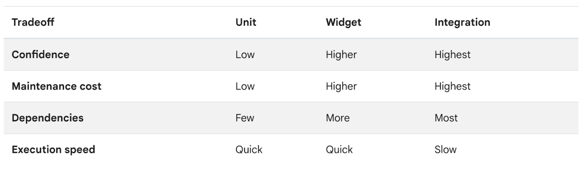

# Flutter Apps Testing

## Types of Testing in Flutter

### 1. Unit testing:
This is the most focused type of test. A unit test ensures that each individual unit of software, whether it's a function, object, or widget, performs its intended task correctly. External dependencies (like databases or network calls) are usually mocked out to ensure the unit itself functions correctly. Unit tests are fast to write and run, making them ideal for catching basic logic errors early in development.

**Example:**    
```dart
import 'package:test/test.dart';
import 'package:testing_app/models/favorites.dart';

void main() {
  group('Testing App Provider', () {
    var favorites = Favorites();

    test('A new item should be added', () {
      var number = 35;
      favorites.add(number);
      expect(favorites.items.contains(number), true);
    });    
  });
}
```

#### Running the Unit Tests
At the command line, navigate to the project's root directory and enter this command:

```sh
flutter test <test_file> # run test file
flutter test test/models/favorites_test.dart 
```
**More ways to run:**   

```sh
flutter test # run all available test
flutter test <folder_name> # run all test inside the folder
```
  
### 2. Widget testing: 
This level tests a single widget or a small group of widgets. It simulates the widget's lifecycle (creation, updates, disposal) and allows you to interact with it programmatically. Widget tests focus on ensuring the UI renders correctly based on different inputs and user interactions. They are more complex than unit tests but still run in a controlled environment. Note that in other UI frameworks this type of testing is referred to as component testing.

To test widget classes, you need a few additional tools provided by the flutter_test package, which ships with the Flutter SDK. As widgets live in the widget tree inside the Flutter context, widget tests require the framework environment to be executed. That is why Flutter provides tools for writing widget tests through the flutter_test package.

```dart
import 'package:flutter/material.dart';
import 'package:flutter_test/flutter_test.dart';
import 'package:provider/provider.dart';
import 'package:testing_app/models/favorites.dart';
import 'package:testing_app/screens/home.dart';

Widget createHomeScreen() => ChangeNotifierProvider<Favorites>(
      create: (context) => Favorites(),
      child: const MaterialApp(
        home: HomePage(),
      ),
    );

void main() {
  group('Home Page Widget Tests', () {
    // Define a test. The TestWidgets function also provides a WidgetTester
    // to work with. The WidgetTester allows you to build and interact
    // with widgets in the test environment.
    testWidgets('Testing if ListView shows up', (tester) async {
      // Create the widget by telling the tester to build it.
      await tester.pumpWidget(createHomeScreen());
      expect(find.byType(ListView), findsOneWidget);
    });                                                
    testWidgets('Testing Scrolling', (tester) async {
      await tester.pumpWidget(createHomeScreen());
      expect(find.text('Item 0'), findsOneWidget);
      await tester.fling(
        find.byType(ListView),
        const Offset(0, -200),
        3000,
      );
      await tester.pumpAndSettle();
      expect(find.text('Item 0'), findsNothing);
    });
    testWidgets('Testing IconButtons', (tester) async {
      await tester.pumpWidget(createHomeScreen());
      expect(find.byIcon(Icons.favorite), findsNothing);
      await tester.tap(find.byIcon(Icons.favorite_border).first);
      await tester.pumpAndSettle(const Duration(seconds: 1));
      expect(find.text('Added to favorites.'), findsOneWidget);
      expect(find.byIcon(Icons.favorite), findsWidgets);
      await tester.tap(find.byIcon(Icons.favorite).first);
      await tester.pumpAndSettle(const Duration(seconds: 1));
      expect(find.text('Removed from favorites.'), findsOneWidget);
      expect(find.byIcon(Icons.favorite), findsNothing);
});
  });
}

```

#### Running the Widget Tests
At the command line, navigate to the project's root directory and enter this command:
```
$ flutter test test/home_test.dart 
```

#### Running on device:
You can also run widget tests using a device or an emulator, which allows you to watch the test running. It also gives you the ability to use hot restart (Shift+R). 

> If you make any changes when the app is running, the `hot restart` restarts the app and re-runs all the tests.

**Step 1:** Plug-in your device or start your emulator. You can also run the test as a desktop application.

**Step 2:** From the command line, navigate to the project's root directory and enter the following command:

```
$ flutter run test/home_test.dart 
```
Note: If multiple devices are found, you'll be prompted to select the devoce.

#### Running All Tests
You can run all the tests in the test directory at once by running:

```sh
$ flutter test
```

To run all tests you put into one group, run the following command from the root of the project:

```sh
flutter test --plain-name "Name of the test group"
```

To learn more about unit tests, you can execute this command:
```sh
flutter test --help
```

### 3. Integration testing:
This is the most comprehensive test type. It tests how various parts of your app (widgets, services, databases, etc.) work together as a whole. Integration tests often involve launching a real or emulated device and simulating user interactions. They can test complex workflows and ensure the entire app functions as intended. However, integration tests can be slower to write and run compared to unit and widget tests.

Writing integration tests in Flutter is similar to writing widget tests, with the exception that integration tests run on a mobile device, browser, or desktop application, called the target device.

#### Writing the Integration Test
- The integration test file consists of a Dart code file with dependencies on integration_test, flutter_test, and your app's Dart file.
- Asynchronous Testing:
   - Integration tests often involve asynchronous operations like waiting for UI updates, network requests, or animations to complete.
   - Use `async` and `await` keywords to handle asynchronous code within your test cases, ensuring that tests wait for asynchronous operations to finish before proceeding.
- Assertions and Verifications:
   - Use assertions and verification methods like `expect`, `find`, and `waitFor` to validate expected behaviors, widget states, UI elements, and responses from APIs or services.
   - For example, `expect(find.byType(MyWidget), findsOneWidget)` verifies that a widget of type `MyWidget` is present in the UI.

Sample Test:
```dart
import 'package:flutter/material.dart';
import 'package:flutter_test/flutter_test.dart';
import 'package:testing_app/main.dart';

void main() {
  group('Testing App', () {
    testWidgets('Favorites operations test', (tester) async {
      await tester.pumpWidget(const TestingApp());

      final iconKeys = [
        'icon_0',
        'icon_1',
        'icon_2',
      ];

      for (var icon in iconKeys) {
        await tester.tap(find.byKey(ValueKey(icon)));
        await tester.pumpAndSettle(const Duration(seconds: 1));

        expect(find.text('Added to favorites.'), findsOneWidget);
      }

      await tester.tap(find.text('Favorites'));
      await tester.pumpAndSettle();

      final removeIconKeys = [
        'remove_icon_0',
        'remove_icon_1',
        'remove_icon_2',
      ];

      for (final iconKey in removeIconKeys) {
        await tester.tap(find.byKey(ValueKey(iconKey)));
        await tester.pumpAndSettle(const Duration(seconds: 1));

        expect(find.text('Removed from favorites.'), findsOneWidget);
      }
    });
  });
}
```

### Cleanup and Teardown

##### Cleanup
In Flutter's testing framework, `setUp()` and `setUpAll()` are methods used to set up the testing environment before running test cases. These methods are particularly useful for initializing common resources, setting up configurations, or performing setup tasks that are required across multiple test cases or for the entire test suite.

Here's an explanation of `setUp()` and `setUpAll()`:

1. **setUp() Method:**
   - The `setUp()` method is used to perform setup tasks before each individual test case. It is called automatically before each test case in the group or file where it's defined.
   - Use `setUp()` when you need to initialize variables, set up mock objects, configure test dependencies, or prepare the environment for a specific test case.
   - This method is especially useful for tasks that need to be repeated for each test case but don't need to persist across multiple test cases.

   ```dart
   setUp(() {
     // Perform setup tasks before each test case
     // Initialize variables, set up mock objects, etc.
   });

   testWidgets('Test Case 1', (WidgetTester tester) async {
     // Test code for Test Case 1
   });

   testWidgets('Test Case 2', (WidgetTester tester) async {
     // Test code for Test Case 2
   });
   ```

2. **setUpAll() Method:**
   - The `setUpAll()` method is used to perform setup tasks once before all the test cases in a test group or file. It runs once for the entire test suite.
   - Use `setUpAll()` for setup tasks that are expensive to repeat for each test case, such as initializing databases, establishing connections, loading resources, or setting global configurations.
   - It's important to note that `setUpAll()` runs before `setUp()` and is not called again for subsequent test cases within the same test group or file.

   ```dart
   setUpAll(() async {
     // Perform setup tasks once before all test cases
     // Initialize databases, establish connections, load resources, etc.
   });

   testWidgets('Test Case 1', (WidgetTester tester) async {
     // Test code for Test Case 1
   });

   testWidgets('Test Case 2', (WidgetTester tester) async {
     // Test code for Test Case 2
   });
   ```

By using `setUp()` and `setUpAll()`, you can ensure that your test environment is properly set up with the required configurations and resources, leading to more efficient and organized testing procedures.

##### Teardown
You can use the `tearDown` function or `tearDownAll` for cleanup tasks that need to be done after all tests in a group have finished.

#### Running the Tests
**Step 1:** Plug-in your device or start your emulator. You can also run the test as a desktop application.

**Step 2:** At the command line, navigate to the project's root directory and enter the following command:

```
$ flutter test integration_test/app_test.dart
```

**Note:** Running integration tests on Chrome requires a different setup, which can be found in the [integration testing documentation](https://docs.flutter.dev/testing/integration-tests).

### The Trade-Off

As the scope of your test expands, so does the complexity. Unit tests are the quickest to write and run, but they only cover a small piece of the puzzle. Integration tests provide the most thorough validation, but they can be time-consuming to set up and maintain.

The key is to find a balance. Use unit tests extensively to catch basic errors early on. Utilize widget tests to ensure your UI renders and behaves correctly. Then, employ well-designed integration tests to validate critical workflows and overall application functionality. This layered approach ensures a robust and well-tested Flutter application.



## Flutter Automation Tool Stack
* The Flutter SDK - check the most up-to-date instructions on how to install the Flutter SDK at `docs.flutter.dev`.
* Editor: Visual Studio Code (VS Code) with the Flutter & Dart plugin. You can also use IntelliJ editor or Android Studio.
* The software required by your chosen development target (Android or iOS)
  * A physical [Android](https://docs.flutter.dev/get-started/install/macos/mobile-android?tab=download#configure-android-development) or [iOS](https://docs.flutter.dev/get-started/install/macos#deploy-to-ios-devices) device connected to your computer and set to Developer mode (optional, you can also use simulator/emulators.)
  * The [iOS simulator](https://docs.flutter.dev/get-started/install/macos#set-up-the-ios-simulator) (requires installing Xcode tools).
  * The [Android Emulator](https://docs.flutter.dev/get-started/install/macos#set-up-the-android-emulator) (requires setup in Android Studio).
* A browser (Chrome is required for debugging).

## Dependencies
To perform testing, you need to add `integration_test` package to your `pubspec.yaml` file. The integration test package [`integration_test`
](https://github.com/flutter/flutter/tree/main/packages/integration_test#integration_test), provided by Flutter is used to write integration tests for your Flutter app. This package uses `flutter_driver` internally to drive the test on a device. You can add this package by adding it to your `pubspec.yaml` file under `dev_dependencies` section.

    ```yaml
    dev_dependencies:
      integration_test:
        sdk: flutter
      flutter_test:
        sdk: flutter
    ```

Alternatively, you can add this package to `pubspec.yaml` by running the following terminal command:

```sh
flutter pub add 'dev:integration_test:{"sdk":"flutter"}'
```

## Folder Structure

* In general, unit & widget test files should reside inside a test folder named `test` located at the root of your Flutter application or package. By convention, the directory structure in the test directory mimics that in the lib directory.
* The integration tests reside inside a test folder named `integration_test` located at the root of your Flutter application
* Test files should always end with _test.dart, this is the convention used by the test runner when searching for tests.
* Integration tests reside in a separate directory inside your Flutter project. 

```
lib/
test/
integration_test/
```
## Test Grouping
* Organization: A group is a way to organize and categorize related tests. Groups help structure your test files by bundling together tests that are logically connected, making your test suite more readable and maintainable.
* Nested Groups: A single test file can contain multiple groups, each designed to test different parts of the corresponding file in the lib directory.
* Shared Setup/Teardown: Groups can include setup (setUp) and teardown (tearDown) logic that runs before and after each test in the group.

**Example:**    
```dart
group('Counter tests', () {
  setUp(() {
    // Common setup code
  });

  tearDown(() {
    // Common teardown code
  });

  test('Counter starts at 0', () {
    // Test logic
  });

  test('Counter increments', () {
    // Test logic
  });
});

```

The `group()` function takes two main arguments:

1. **Name (String):** This is the name or description of the group. It provides context and clarity about what the group of tests is intended to achieve or test.

2. **Callback Function (void callback()):** This callback function contains the actual tests that belong to this group. Inside the callback, you can define multiple `testWidgets` or `test` blocks, each representing an individual test case.

Here's an example of how `group()` is typically used in Flutter tests:

```dart
void main() {
  group('MyWidget Tests', () {
    testWidgets('Test Case 1', (WidgetTester tester) async {
      // Test code for Test Case 1
    });

    testWidgets('Test Case 2', (WidgetTester tester) async {
      // Test code for Test Case 2
    });

    // Add more test cases as needed
  });

  group('OtherWidget Tests', () {
    testWidgets('Test Case A', (WidgetTester tester) async {
      // Test code for Test Case A
    });

    testWidgets('Test Case B', (WidgetTester tester) async {
      // Test code for Test Case B
    });

    // Add more test cases as needed
  });

  // Add more groups and tests as needed
}
```

In this example:

- `group('MyWidget Tests', ...)` and `group('OtherWidget Tests', ...)` are two groups of tests, each containing multiple test cases (`testWidgets` blocks).
- The callback functions inside each group contain the actual test code for each test case.

Using `group()` helps in organizing your test suite, making it easier to manage and understand, especially as the number of tests grows. It provides a hierarchical structure where you can group related tests together based on their functionality or the widgets they are testing.

## Test Packages

### The `test` Package 
- The [`test`](https://pub.dev/packages/test) package offers essential functionality for writing tests in Dart. However, you don't need to add this package to your `pubspec.yaml` file because the `flutter_test` library, which wraps the `test` package, is already included in the Flutter SDK. When we generate a Flutter project, the `flutter_test` package dependency is added for us automatically and a sample test is generated in the test/ directory.

```yaml
dev_dependencies:
  flutter_test:
    sdk: flutter
```
- Tests are specified using the top-level test() function. 
- Test asserts can be made using [expect from package:matcher](https://pub.dev/documentation/matcher/latest/expect/expect.html)
- The test package’s main library exposes functions such as setUp(), test(), and expect(). Each of the functions has specific roles, as follows:
  * setUp() will execute the callback we pass to it before each of the tests in the test suite.
  * test() is the test itself; it receives a description and a callback with the test implementation.
  * expect() is used to make assertions about the test. In the preceding example, we are just asserting a sum of 1 + 2, which should result in 3.
  * The expect() method is used in conjunction with finder and Matcher to make assertions on widgets found – just like the expect() function we looked at in the Unit testing section.

### The `flutter_test` Package
- The `flutter_test` package is shipped with the Flutter SDK. It is built on top of the `test` package, and, in addition to the unit testing tools, it also provides a set of tools that help us write and run widget tests.
- It includes classes and utilities like `WidgetTester`, `TestWidgetsFlutterBinding`, and `testWidgets()` function, which are essential for writing and running tests that interact with Flutter widgets and UI components.
- We do not need to instantiate this class by ourselves as the framework provides the `testWidgets()` function. This function sets up a `WidgetTester` instance to interact with the environment.
- It does not support testing scenarios that require interaction with platform-specific features, external APIs, or multiple screens/pages within the app.
- Widget tests use `TestFlutterWidgetsBinding`, a class that provides the same resources to your widgets that they would have in a running app, e.g. information about screen size, the ability to schedule animations, but without running inside an app. Instead, a virtual environment is used to instantiate the widget, and then run tests the results. Here, `pumpWidget` kicks off the process by telling the framework to mount and measure a particular widget just as it would in an application.

Here are some of the key methods available in `flutter_test`:

1. **testWidgets():**
- The `testWidgets()` function is the entry point for writing widget tests in Flutter.
- This method takes two required parameters. Three optional parameters are also worth exploring:
  - description: This required parameter helps document the test; that is, it describes what widget features are being tested.
  - callback: This required parameter is WidgetTesterCallback. This callback receives a `WidgetTester` instance so that we can interact with the widget and make our validations. This is the body of the test, where we write our test logic.
  - skip: We can skip the test when running multiple tests by setting this optional flag. The default value is false.
  - timeout: This optional parameter is the maximum time the test callback can run. The default value is to have no limitation.
  - variant: This parameter will allow you to run the tests multiple times with different input values.

```dart
void testWidgets(
  String description,
  WidgetTesterCallback callback,
  { bool skip: false,
    Timeout timeout,
    TestVariant<Object?> variant = const DefaultTestVariant
      ()},
)
```
**Example:**

```dart
  testWidgets('Widget Test Description', (WidgetTester tester) async {
    // Test logic and assertions using tester
  });
  ```

2. **WidgetTester:**
   - The `WidgetTester` class is used to interact with widgets and perform actions like tapping, scrolling, entering text, and verifying widget states.
   - It provides methods like `tap()`, `drag()` `longPress()`, `enterText()`, `scroll()`, `pump()`, `pumpAndSettle()`, etc., for testing widget behaviors.

   ```dart
   await tester.tap(find.text('Button'));
   ```

3. **find():**
   - The `find()` method is used to locate widgets within the widget tree during tests.
   - It takes a `Finder` object that specifies how to locate the widget based on its properties or context.

   ```dart
   find.byType(TextButton);
   ```

4. **pump():**
   - The `pump()` method is used to pump frames and trigger widget rebuilds during tests.
   - It advances the app's state and UI by a specified duration, allowing you to test widget updates and animations.

   ```dart
   await tester.pump(Duration(milliseconds: 500));

5. **pumpAndSettle():**
   - The `pumpAndSettle()` method is used to pump frames and settle animations until there are no pending frame callbacks or microtasks.
   - It ensures that all animations and asynchronous operations are completed before proceeding with test assertions.

   ```dart
   await tester.pumpAndSettle();
   ```

6. **expect():**
   - The `expect()` method is used to make assertions and verify expected outcomes during widget tests.
   - It compares actual values with expected values and throws an error if the assertion fails.

   ```dart
   expect(find.text('Hello'), findsOneWidget);
   ```

7. **Mocking:**
   - The `flutter_test` package also supports mocking dependencies and services using libraries like `mockito`.
   - This allows you to mock network requests, databases, and other external dependencies for isolated testing.

In many cases, user interactions update the state of the app. In the test environment, Flutter doesn't automatically rebuild widgets when the state changes. To ensure that the widget tree is rebuilt after simulating a user interaction, call the `pump()` or `pumpAndSettle()` methods provided by the WidgetTester. 

These methods, along with utilities like `Key`, `ValueKey`, `Mockito`, and `Matcher` classes, provide a comprehensive testing framework for writing widget tests in Flutter. They enable you to simulate user interactions, verify widget states, and test UI behaviors within your app.

### The `integration_test` Package:
- The `integration_test` package extends Flutter's testing capabilities to support integration tests.
- Integration tests are designed to test the interaction and integration of various components within a Flutter app, including UI widgets, navigation, platform channels, and external dependencies.
- Integration tests are more comprehensive than widget tests and often involve scenarios that span multiple screens, simulate user interactions, validate state changes, and interact with backend services or databases.
- The `integration_test` package provides tools and APIs for writing and running integration tests, including the `IntegrationTestWidgetsFlutterBinding`, `integrationDriver()`, and utilities for launching and managing the app during tests.

Here are some of the key methods available in `integration_test`:

1. **integrationDriver():**
   - This method is used to create an integration test driver that controls the Flutter app during integration tests.
   - It should be called in the `main()` function of your integration test file to initialize the test driver.

   ```dart
   Future<void> main() => integrationDriver();
   ```

2. **testWidgets():**
   - The `testWidgets()` function is similar to the one provided by `flutter_test` and is used to define individual test cases within your integration tests.
   - It takes a callback function that contains the test logic and assertions, executed using a `WidgetTester` instance.

   ```dart
   testWidgets('Test Case Description', (WidgetTester tester) async {
     // Test logic and assertions using tester
   });
   ```

3. **pumpAndSettle():**
   - The `pumpAndSettle()` method is used to pump frames and settle animations in the app during integration tests.
   - It ensures that all pending microtasks, animations, and frame updates are processed before proceeding with test assertions.

   ```dart
   await tester.pumpAndSettle();
   ```

4. **tap():**
   - The `tap()` method is used to simulate a tap gesture on a widget during integration tests.
   - It takes a `Finder` to locate the widget to tap and triggers the onTap callback if available.

   ```dart
   await tester.tap(find.byKey(const Key('myWidget')));
   ```

5. **enterText():**
   - The `enterText()` method is used to simulate text input into text fields or input widgets during integration tests.
   - It takes a `Finder` to locate the text input field and enters the specified text.

   ```dart
   await tester.enterText(find.byKey(const Key('textField')), 'Hello, world!');
   ```

6. **waitFor():**
   - The `waitFor()` method is used to wait for a specified condition to be met during integration tests.
   - It takes a `Finder` and a timeout duration, waiting until the finder matches at least one widget or until the timeout is reached.

   ```dart
   await tester.waitFor(find.text('Welcome'));
   ```

7. **expectLater():**
   - The `expectLater()` method is used to assert asynchronous operations or changes during integration tests.
   - It works similarly to `expect()` from `flutter_test` but is used for asynchronous expectations.

   ```dart
   expectLater(myStream, emits('data'));
   ```

These methods, along with other utilities and classes provided by `integration_test`, enable you to write comprehensive integration tests for your Flutter apps, covering UI interactions, state changes, navigation, and external dependencies.

There are some methods that are available in both `flutter_test` and `integration_test` packages, but they serve slightly different purposes or contexts within the testing framework.

1. **testWidgets():**
   - This method is available in both `flutter_test` and `integration_test`. However, in `flutter_test`, it is used for writing widget tests specifically, whereas in `integration_test`, it is used for writing integration tests that involve running the entire Flutter app.

2. **WidgetTester:**
   - The `WidgetTester` class is also available in both packages. In `flutter_test`, it is used to interact with widgets and perform actions within the context of widget tests. In `integration_test`, it can be used similarly but within the broader context of integration tests that involve the entire app.

3. **find():**
   - The `find()` method is available in both packages and is used to locate widgets within the widget tree. In `flutter_test`, it is used primarily for widget tests to find and interact with widgets. In `integration_test`, it can be used similarly but in the context of integration tests that involve testing widget interactions in the app.

4. **expect():**
   - The `expect()` method is available in both packages and is used for making assertions and verifying expected outcomes in tests. In `flutter_test`, it is used within widget tests to verify widget states and behaviors. In `integration_test`, it can be used for similar purposes but in the broader context of integration tests.

While these methods have similar names and functionalities across `flutter_test` and `integration_test`, their usage and context within the testing framework may vary. Widget tests in `flutter_test` focus on testing individual widgets and UI components, while integration tests in `integration_test` focus on testing the integration and behavior of the entire Flutter app.

## Key Concepts
* **Finder:** Used to locate specific widgets within the app's UI for verification.
* **pump():** Triggers a rebuild of the widget tree after making changes to the app state or performing user interactions.
* **Matchers:** Used to assert the expected behavior of the app after performing actions. Common matchers include `findsOneWidget`, `findsNothing`, and `findsNWidgets`.
  
### What is Pump?

The "pump" refers to the process of advancing the state of the widget being tested to the next frame. This concept is essential for widget testing because it simulates the normal flow of a Flutter application, where widgets are rebuilt and updated in response to changes in their state or the environment.

Here are a few key things to know about pumping in Flutter widget tests:

1. **Widget Tree Update**: When you pump in a widget test using `tester.pump()`, `tester.pumpAndSettle()`, or similar methods, you're instructing the testing framework to update the widget tree. This update may involve rebuilding widgets, processing layout changes, handling animations, etc.

2. **Advancing Time**: Pumping can also advance the virtual time in your widget tests. For example, if you have animations or asynchronous operations in your widget, pumping can simulate the passage of time to trigger these animations or async tasks.

3. **Rebuild Widgets**: After making changes to the widget's state or performing actions like tapping buttons, entering text, etc., you typically pump to ensure that the changes are reflected in the widget tree. This allows you to test the updated UI state.

4. **pump() vs pumpAndSettle()**:
   - `pump()` advances time by a very small amount, typically just enough to trigger a rebuild of the widget. It's useful for testing immediate updates.
   - `pumpAndSettle()` advances time until there are no pending asynchronous tasks, animations, or microtasks remaining. It's useful for testing the final state of the UI after all asynchronous operations have completed.
  
## Element Identification using `key` property
In Flutter, the `key` property is used to uniquely identify widgets. 
```dart
floatingActionButton: FloatingActionButton(
   key: const ValueKey('increment'),
   onPressed: _incrementCounter,
   tooltip: 'Increment',
   child: const Icon(Icons.add),
 ),

```
This line `key: const ValueKey('increment')` assigns a unique identifier to the `FloatingActionButton` widget using the ValueKey constructor. The value 'increment' is the identifier assigned to this widget. It's important to note that const is used here to optimize memory usage by creating a compile-time constant key.

To use this key in your test code, you can write below code:
```dart
// Finds the floating action button to tap on.
      final fab = find.byKey(const ValueKey('increment'));

      // Emulate a tap on the floating action button.
      await tester.tap(fab);

```

## Widget Finders
In Flutter's testing framework, there are several `find` methods available for locating widgets within the widget tree during widget testing. These `find` methods help in identifying specific widgets based on various criteria. Here are some commonly used `find` methods:

1. **find.byType()**:
   - Searches for widgets based on their type. For example, `find.byType(Text)` would find widgets of type `Text` in the widget tree.

2. **find.byKey()**:
   - Locates widgets based on their unique `Key`. This method is often used to find specific widgets that have been assigned keys for identification.
   - A key uniquely identifies a widget amongst its siblings in the widget tree.

3. **find.text()**:
   - Finds widgets containing the specified text. For example, `find.text('Submit')` would find widgets displaying the text "Submit".

4. **find.widget()**:
   - Searches for widgets that match a given widget instance. This can be useful for finding custom widgets or specific instances of built-in widgets.

5. **find.byTooltip()**:
   - Locates widgets based on their tooltip message. This is helpful for testing widgets that display tooltips.

6. **find.descendant()**:
   - Searches for widgets that are descendants of a specified parent widget. This method is useful for locating nested widgets within a widget hierarchy.

7. **find.ancestor()**:
   - Finds widgets that are ancestors of a specified descendant widget. It's the counterpart of `find.descendant()` and is useful for navigating up the widget tree.

8. **find.bySemanticsLabel()**:
   - Searches for widgets based on their semantic label. This is particularly useful for testing accessibility features and widgets with semantic labels.

```
  final name = find.byKey(const Key('text-field-name'));
  final yearBorn = find.byKey(const Key('text-field-year-born'));
  final submit = find.byKey(const Key('button-submit'));
```  

These are some of the commonly used `find` methods in Flutter's testing framework. They provide a flexible and powerful way to locate and interact with widgets during widget testing.

For a full list of available finders, see the [CommonFinders documentation](https://api.flutter.dev/flutter/flutter_test/CommonFinders-class.html).

## Matchers
Flutter's testing framework provides several variations of the `findsOneWidget` matcher, each serving a specific purpose based on the testing needs. Here are some variations of `findsOneWidget` and their purposes:

1. **findsWidgets**:
   - Asserts that one or more widgets are found in the widget tree matching the given finder. This matcher is more general than `findsOneWidget` because it allows for multiple widgets to match the finder.

2. **findsNothing**:
   - Asserts that no widgets are found in the widget tree matching the given finder. This is useful for ensuring that certain widgets are not present under certain conditions.

3. **findsNWidgets**:
   - Asserts that exactly N widgets are found in the widget tree matching the given finder. This is useful for cases where a specific number of widgets should be present, neither more nor fewer.

4. **findsOneWidget(matcher)**:
   - This variation allows you to specify an additional matcher to further refine the search criteria. For example, `findsOneWidget.findsOneWidget` can be used to find a widget that matches both the initial finder and the inner matcher.

5. **findsExactlyOneWidget**:
   - Similar to `findsOneWidget`, this matcher specifically asserts that exactly one widget is found in the widget tree matching the given finder. It's more explicit than `findsOneWidget` in its intent.

These variations provide flexibility in writing widget tests by allowing you to specify different expectations about the presence, absence, or quantity of widgets in the widget tree. They are helpful for creating precise and reliable widget tests that accurately verify the UI behavior of your Flutter app.

## Testing app performance with Flutter Driver

**Sample Test:**

```dart
import 'package:flutter/material.dart';
import 'package:flutter_test/flutter_test.dart';
import 'package:integration_test/integration_test.dart';
import 'package:testing_app/main.dart';

void main() {
  group('Testing App Performance', () {
    final binding = IntegrationTestWidgetsFlutterBinding.ensureInitialized();
    binding.framePolicy = LiveTestWidgetsFlutterBindingFramePolicy.fullyLive;

    testWidgets('Scrolling test', (tester) async {
      await tester.pumpWidget(const TestingApp());

      final listFinder = find.byType(ListView);

      await binding.traceAction(() async {
        await tester.fling(listFinder, const Offset(0, -500), 10000);
        await tester.pumpAndSettle();

        await tester.fling(listFinder, const Offset(0, 500), 10000);
        await tester.pumpAndSettle();
      }, reportKey: 'scrolling_summary');
    });
  });
}
```
The `ensureInitialized()` function verifies if the integration test driver is initialized, reinitializing it if required. Setting `framePolicy` to `fullyLive` is good for testing animated code.

This test scrolls through the list of items really fast and then scrolls all the way up. The `traceAction()` function records the actions and generates a timeline summary.

### Capture the performance results

To capture the results, create a folder named test_driver with a file named perf_driver.dart, and add the following code:

```dart
import 'package:flutter_driver/flutter_driver.dart' as driver;
import 'package:integration_test/integration_test_driver.dart';

Future<void> main() {
  return integrationDriver(
    responseDataCallback: (data) async {
      if (data != null) {
        final timeline = driver.Timeline.fromJson(
            data['scrolling_summary'] as Map<String, dynamic>);

        final summary = driver.TimelineSummary.summarize(timeline);

        await summary.writeTimelineToFile(
          'scrolling_summary',
          pretty: true,
          includeSummary: true,
        );
      }
    },
  );
}
```

### Running the Test
**Step 1:** Plug-in your device or start your emulator.
**Step 2:** At the command line, navigate to the project's root directory and enter the following command:

```sh
$ flutter drive \
  --driver=test_driver/perf_driver.dart \
  --target=integration_test/perf_test.dart \
  --profile \
  --no-dds
```
After the test completes successfully, the build directory at the root of the project contains two files:

* `scrolling_summary.timeline_summary.json` contains the summary. Open the file with any text editor to review the information contained within.
* `scrolling_summary.timeline.json` contains the complete timeline data.

For more details on performance testing, check [performance profiling](https://docs.flutter.dev/cookbook/testing/integration/profiling).

## Code Coverage and Reporting
Code coverage tools help identify untested parts of your codebase. To measure code coverage, use the --coverage flag with flutter test.

flutter test --coverage
You can view the coverage report in HTML format using tools like lcov.

## Flutter's Limitations:
Flutter's built-in testing tools have limitations when it comes to testing WebViews or native views:

1. **WebViews**:
   - Testing content within WebViews (like embedded web content) using Flutter's built-in testing tools is challenging.
   - Flutter's testing framework primarily focuses on testing Flutter widgets and UI components rendered using the Flutter engine. WebViews are separate components that render web content using the platform's web engine (e.g., WebView on Android, WKWebView on iOS).

2. **Native Views**:
   - Flutter's testing tools are designed to test Flutter widgets and UI elements that are rendered using Flutter's rendering engine, which creates a barrier when testing native platform views.
   - Native views, such as Android Views or iOS UIViews, are not directly accessible or controllable through Flutter's testing framework.

## Additional Resources

### Blogs
* [Locator Strategies in Flutter Integration Tests](https://medium.com/welltested-ai/locator-strategies-in-flutter-integration-tests-1ad7cba67988)
* [Flutter: Choosing Mobile UI Tests Automation Tool](https://itnext.io/flutter-choosing-ui-tests-automation-tool-1a42336b09d7)
* [Semantics class](https://api.flutter.dev/flutter/widgets/Semantics-class.html)
* [Mocking in Flutter: Testing Data Providers and Web Services for Quotes App](https://medium.com/@wafamohameddd/mocking-in-flutter-testing-data-providers-and-web-services-for-quotes-app-f36f8602391d)
* [Mastering Flutter Testing and QA](https://medium.com/@yusrasajjad613/mastering-flutter-testing-and-qa-66425c6315c4) - Check CI/CD
* https://iiro.dev/writing-widget-tests-for-navigation-events/
* https://stackoverflow.com/questions/60355792/how-to-setup-a-widgettester-for-multiple-tests-in-flutter
* https://github.com/flutter/flutter/issues/100836

### Courses
* [Flutter & Dart - The Complete Guide [2024 Edition]](https://www.udemy.com/course/learn-flutter-dart-to-build-ios-android-apps/)

### GitHub Repos
* https://github.com/PacktPublishing/Flutter-for-Beginners-Third-Edition - Book Code Repo
* https://github.com/academind/flutter-complete-guide-course-resources - Udemy Course Repo
* https://github.com/md-weber/flutter_testing_tutorial - Tutorial
* https://github.com/bgoktugozdemir/Flutter-Testing - General Structure
* https://github.com/sahnamm/fake_cheers_app/  - Element locator definitions
* https://github.com/maheshmnj/flutter-Testing - Flutter Testing Using BDD
* https://github.com/bgoktugozdemir/Flutter-Testing - Shell Scripts Examples
* https://github.com/bwnyasse/flutter-testing-tutorial - CI YAML
* https://medium.com/@NALSengineering/a-complete-guide-to-testing-in-flutter-part-4-advanced-unit-testing-926b00373e09