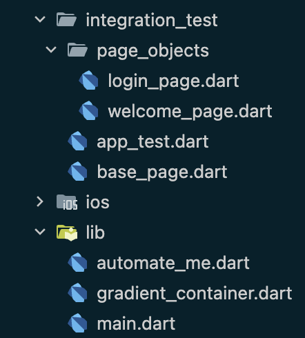

# Implementing POM in Flutter

Automated Integration testing is crucial to guarantee a high-quality user experience. However, managing these tests can become increasingly complex as your application grows. Writing maintainable and reusable integration tests is essential for efficient app development. The **Page Object Model (POM)** can help you achieve this goal. This blog post will explore how to implement the Page Object Model in integration tests for Flutter apps.

## What is the Page Object Model?

The Page Object Model is a design pattern used in test automation that creates an abstraction of the application's user interface. Each page of the application is represented by a page object class, encapsulating the interactions (like button clicks) and verifications (like checking text) that can be performed on that page. This separation of UI logic from test cases promotes code clarity and simplifies maintenance.  Let's explore how to implement POM for a sample Flutter app to see these benefits in action.

## Setting Up Your Flutter Project

Before we implement POM, first set up your Flutter project for integration testing by following the below steps:

1. **Add the `integration_test` package to your `pubspec.yaml`:**
The integration test package [`integration_test`
](https://github.com/flutter/flutter/tree/main/packages/integration_test#integration_test), provided by Flutter is used to write integration tests for your Flutter app. This package uses `flutter_driver` internally to drive the test on a device. You can add this package by adding it to your `pubspec.yaml` file under `dev_dependencies` section.

    ```yaml
    dev_dependencies:
      integration_test:
        sdk: flutter
      flutter_test:
        sdk: flutter
    ```

Alternatively, you can add this package to `pubspec.yaml` by running the following terminal command:

```sh
flutter pub add 'dev:integration_test:{"sdk":"flutter"}'
```

2. **Create a test directory for your integration tests:**
Integration tests reside in a separate directory inside your Flutter project. 
Create a directory called integration_test in the project's root directory to place all integrations tests.

    ```
    lib/
    test/
    integration_test/
    ```
## Creating the Base Page

Create a page `base_page.dart` under the `integration_test` folder. This Base Page will encapsulate common actions and elements used across multiple pages. Here’s how you can create a Base Page class:

```dart
import 'package:flutter/material.dart';
import 'package:flutter_test/flutter_test.dart';

class BasePage {
  final WidgetTester tester;

  BasePage(this.tester);

  Future<void> tap(Finder finder) async {
    await tester.tap(finder);
    await tester.pumpAndSettle();
  }

  Future<void> enterText(Finder finder, String text) async {
    await tester.enterText(finder, text);
    await tester.pumpAndSettle();
  }

  Future<bool> isVisible(Finder finder) async {
    return finder.evaluate().isNotEmpty;
  }

  Finder findByKey(Key key) {
    return find.byKey(key);
  }

  Finder findByText(String text) {
    return find.text(text);
  }
}

```

This Base Page class provides common methods such as `tap`, `enterText`, and `isVisible` that can be used by all page objects.

## Creating Page Objects

Each page of your application will have a corresponding page object class that extends the Base Page. Let’s create a couple of page objects: `WelcomePage` and `LoginPage` under page_objects folder.



### WelcomePage

```dart
// welcome_page.dart
import 'package:flutter/material.dart';
import 'package:flutter_test/flutter_test.dart';
import '../base_page.dart';

class WelcomePage extends BasePage {
  WelcomePage(super.tester);

  final Finder automateMeButton = find.byKey(const Key('automateMeButton'));

  Future<void> clickAutomateMe() async {
    await tap(automateMeButton);
  }
}

```
### LoginPage

```dart
import 'package:flutter/material.dart';
import 'package:flutter_test/flutter_test.dart';
import '../base_page.dart';

class LoginPage extends BasePage {
  LoginPage(super.tester);

  final Finder emailField = find.byKey(const Key('emailField'));
  final Finder passwordField = find.byKey(const Key('passwordField'));
  final Finder loginButton = find.byKey(const Key('loginButton'));

  Future<void> enterEmail(String email) async {
    await enterText(emailField, email);
  }

  Future<void> enterPassword(String password) async {
    await enterText(passwordField, password);
  }

  Future<void> clickLogin() async {
    await tap(loginButton);
  }
}

```

These page objects define specific interactions and elements for their respective screens.

## Writing Integration Tests

Now, let’s write an integration test that uses these page objects to navigate from the welcome screen to the login screen.

```dart
// app_test.dart
import 'package:flutter_test/flutter_test.dart';
import 'package:integration_test/integration_test.dart';
import 'package:your_project/main.dart' as app;
import 'page_objects/welcome_page.dart';
import 'page_objects/login_page.dart';

void main() {
  IntegrationTestWidgetsFlutterBinding.ensureInitialized();

  testWidgets('Welcome Page Test', (WidgetTester tester) async {
    app.main();
    await tester.pumpAndSettle();

    // Create page objects
    final welcomePage = WelcomePage(tester);
    final loginPage = LoginPage(tester);

    // Test welcome screen
    expect(await welcomePage.isVisible(welcomePage.automateMeButton),
        isTrue);
    await welcomePage.clickAutomateMe();

    // Test login screen
    await tester.pumpAndSettle();
    expect(await loginPage.isVisible(loginPage.emailField), isTrue);
    await loginPage.enterEmail('test@example.com');
    await loginPage.enterPassword('password');
    await loginPage.clickLogin();

    // Add further checks or navigation as needed
  });
}

```

## Running the Tests
**Step 1:** Plug-in your device or start your emulator. 

**Step 2:** At the command line, navigate to the project's root directory and enter the following command:

```
flutter test integration_test/app_test.dart
```

## Conclusion

Implementing the Page Object Model with a Base Page class establishes a foundation for writing clean, maintainable, and reusable test code in your Flutter applications. This approach effectively isolates the complexities of your UI interactions within the page object classes, allowing you to concentrate on testing the core functionalities of your app. As a result, your integration tests become easier to write, understand, and modify, ultimately contributing to the improved quality of your Flutter application.

Happy testing!


