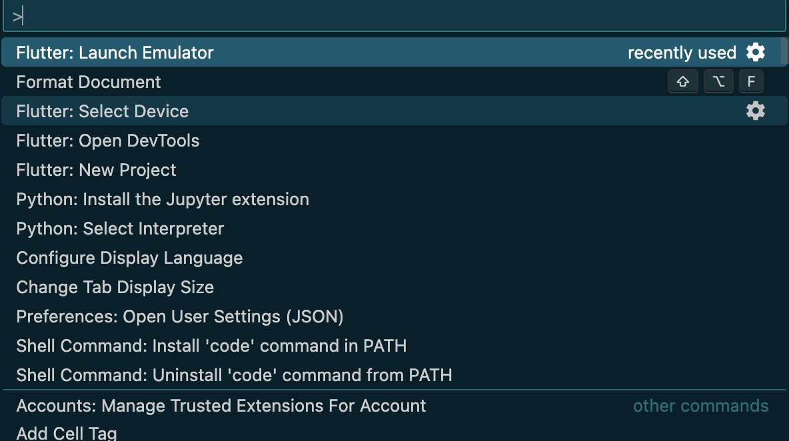
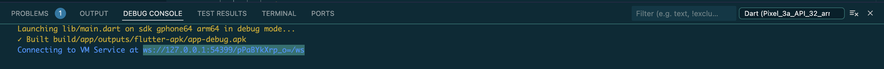
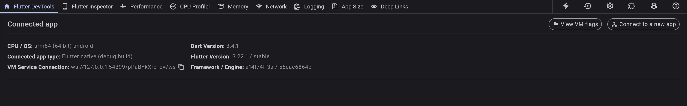
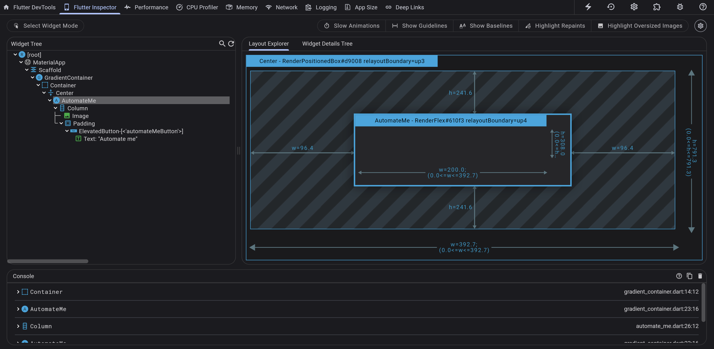

# Understanding Flutter Basics

## What is Flutter?
Flutter is Google's UI toolkit for building beautiful, natively compiled applications for mobile, web, and desktop from a single codebase.

### Supported Platforms
**Mobile:** iOS and Android   
**Desktop:** Windows, MacOS, Linux   
**Web** 

## Things to know
* Widgets: `Widgets` are the elements from which you build every Flutter app. Even the app itself is a widget. Having separate widgets for separate logical parts of your UI is an important way of managing complexity in Flutter.
* The `pubspec.yaml` file specifies basic information about your app, such as its current version, its dependencies, and the assets with which it will ship.
* The `analysis_options.yml` file configures the analyzer, which statically analyzes Dart code to check for errors, warnings, and lints. This file determines how strict Flutter should be when analyzing your code.
* The `devtools_options.yml` file is a configuration file for customizing Dart DevTools, which is used for performance monitoring and debugging in Flutter and Dart applications. This file allows you to set various options such as the port on which DevTools runs, the theme (light or dark), network monitoring settings, logging levels, and notification preferences. By configuring this file, you can streamline your DevTools setup and ensure that your preferred settings are automatically applied whenever you use Dart DevTools.
* **Stateful Hot Reload:** `Stateful Hot Reload` is a feature in Flutter that allows developers to see changes in their code almost instantly without losing the state of the app. When you use Stateful Hot Reload, the Flutter framework preserves the state of your app (such as variables, data entered by users, and so on) while applying the code changes. Hot reload is triggered when you save changes to a source file. Note that Flutter can't hot-reload web applications. 

## Installation:
* Check the most up-to-date instructions on how to install the Flutter SDK at `docs.flutter.dev`.
* Tools to install
  * Flutter SDK
  * Visual Studio Code with the Flutter & Dart plugin
  * The software required by your chosen development target

## Creating a new Flutter project:
* Check https://docs.flutter.dev/get-started/test-drive
* Check https://codelabs.developers.google.com/codelabs/flutter-codelab-first#0

## How to run a Flutter App
### Running using VS Code
1. Open the Command Palette.
2. Select the `Flutter: Select Device`. Note that if no devices are running, this command prompts you to enable a device.
3. Select a target device from `Select Device` prompt.
4. After you select a target, start the app. Go to **Run > Start Debugging** or press `F5`. Wait for the app to launch.
**Alternate way to select device:** At the bottom right corner of VS Code, you'll find a button that shows the current target device. Click to change it.

> Target device: The mobile device, browser, or desktop application that runs your Flutter app.

### Running using terminal
Use the command `flutter run` to execute the app on a device that is already running.

## Flutter DevTools

Flutter DevTools, also known as Dart DevTools, is a collection of built-in tools that aid developers in creating high-performing Flutter apps. It's essentially a debugger toolkit that helps you identify and fix issues within your Flutter application.

Here are some of the functionalities of Flutter DevTools:

* **Inspecting the UI:** You can visually examine the layout and state of your Flutter app's user interface. This helps in debugging visual problems and ensuring your app's UI looks as intended.
* **Performance analysis:** DevTools provides profiling tools to analyze your app's performance aspects like CPU and network usage. This helps you pinpoint bottlenecks and optimize your app for a smoother user experience.
* **Memory debugging:** DevTools equips you with tools to identify and resolve memory leaks within your Flutter or Dart code.
* **Source-level debugging:** You can set breakpoints and step through your code line by line to identify and fix logical errors.
* **General debugging:** DevTools allows you to view logs and diagnostic information to gain insights into your app's overall health.

### How to start Flutter DevTools
1. Open the Command Palette.
2. Select the `Flutter: Open DevTools`.
3. Select `Open DevTools in Web Browser`.
4. Copy the `VM Service` URL from your terminal's Debug 

5. Paste into the running DevTool's VM Service URL box

To learn more, check this video [Dive into DevTools](https://www.youtube.com/watch?v=_EYk-E29edo&t=261s) on Flutter's official YouTube channel.