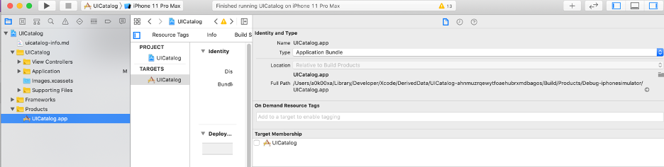
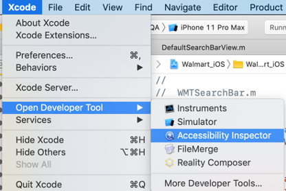
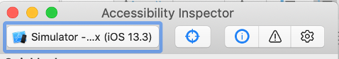
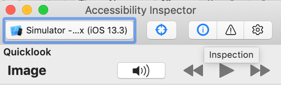

# iOS How-Tos

### How to get an ipa file?
1.	Navigate to the folder with your app.
2.	Now build the project from XCode.
3.	Get the path of the app file:



### How to use Accessibility Inspector?
1.	Open Accessibility Inspector



2.	Open Simulator
3.	Connect your inspector with Simulator



4.	Open the screen on simulator that you want to inspect.
5.	Click info icon from Inspector 



6.	Now use Forward/Backward button to go through the elements, or you can also enable screen reader (using play button)


### Solving iOS App Install Issues: 
When you have OSX Catalina or higher and try to manually install a downloaded iOS app, you can get an error: `App is damaged and can't be opened. You should move it to the trash.`,  

This is due to the new security settings in Catalina. This will not bother you when you install the app through Appium and or Appium desktop.

You can fix this with the following steps before dragging the app to the simulator:
1.	Unzip the app
2.	Open a terminal and go to the folder where the app is located
3.	Execute the following command from the command line
```sh
sudo xattr -rd com.apple.quarantine {name-of-the-unzipped-app}.app
```
4.	After typing your password the app has been modified and you can drag an drop it manually to the simulator
