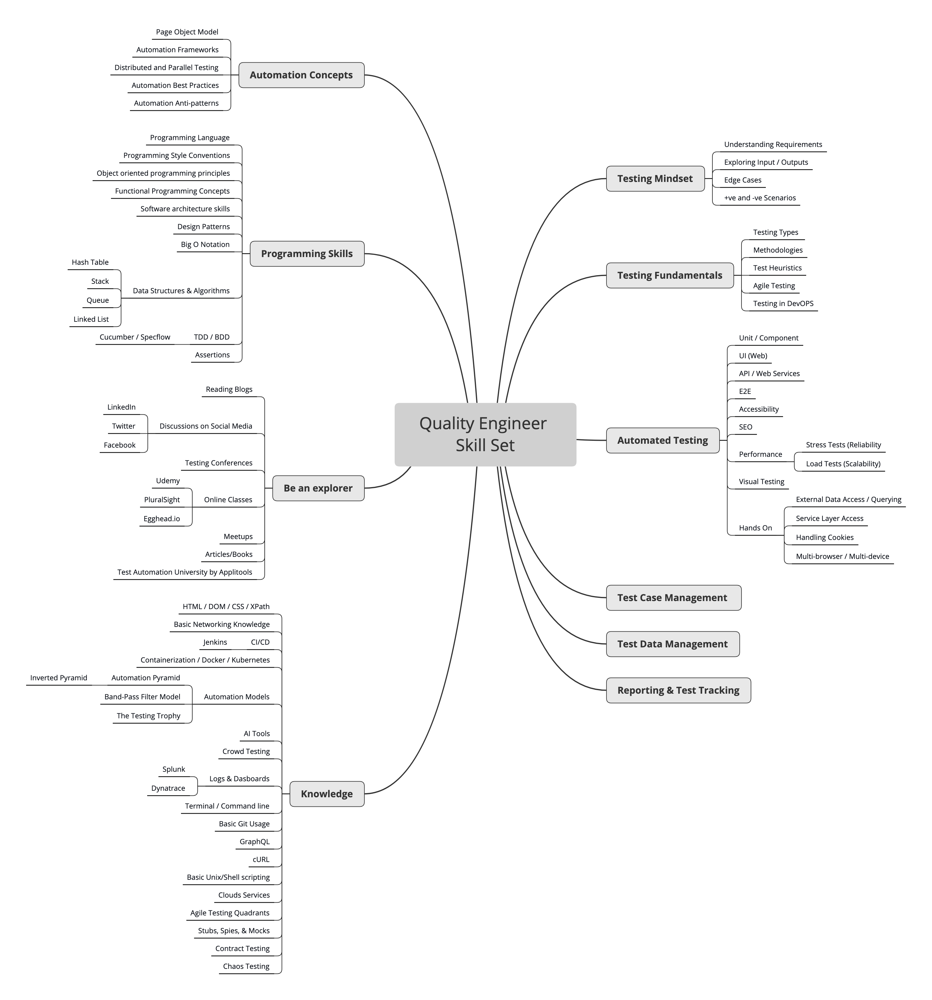

# Introduction
- Introduction to Software Testing (definitions, importance)
- Testing Life Cycle (STLC) phases (planning, design, execution, reporting)
- Types of Testing (functional, non-functional, black box, white box)
- Test Case Design techniques (equivalence partitioning, boundary value analysis)
- Defect Life Cycle (DLC)

