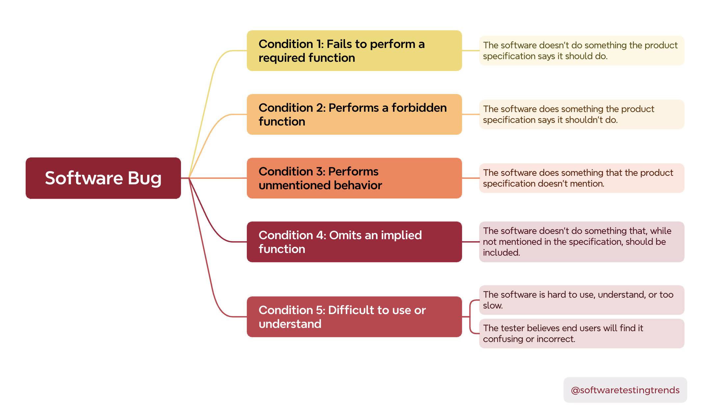
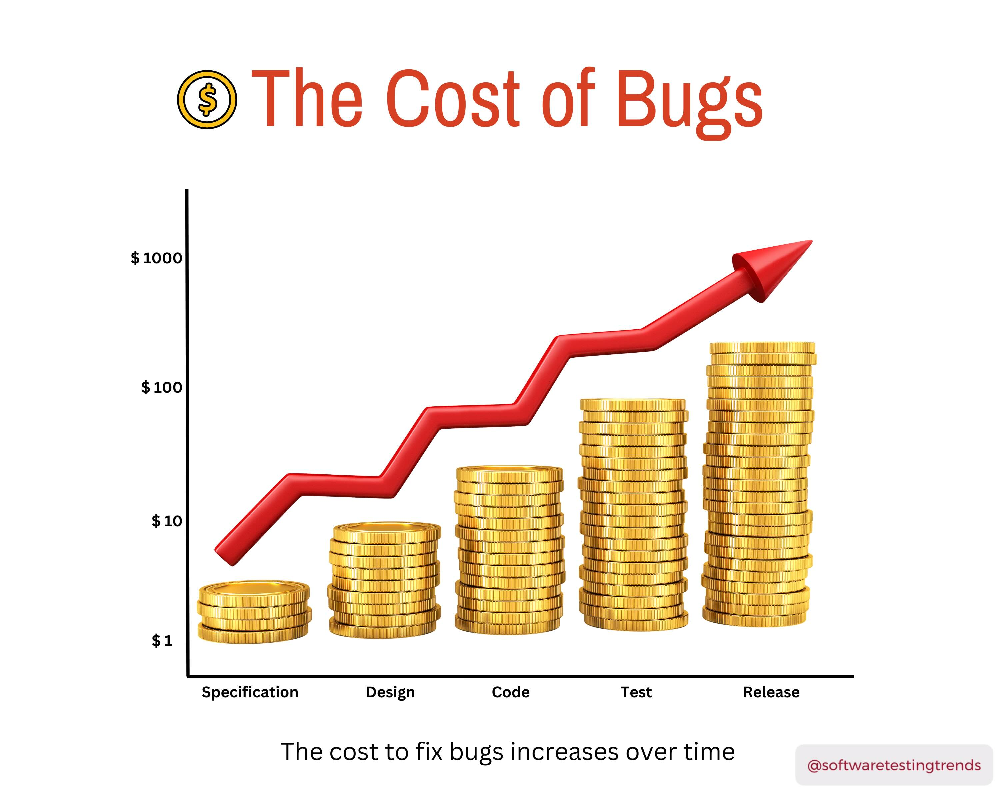
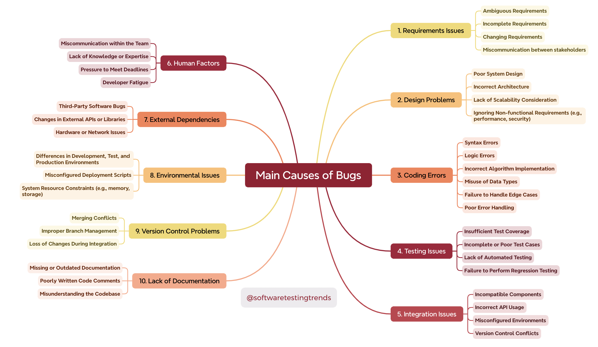

# Software Testing Concepts

## What Defines a Software Bug?

When working in software development or testing, understanding the root causes of software bugs is crucial. I’ve broken down five key conditions that can lead to a bug, summarized in the mind map below:

1️⃣ Fails to perform a required function.  
2️⃣ Performs something it shouldn't.  
3️⃣ Exhibits unmentioned behavior.  
4️⃣ Omits a function that should be included.   
5️⃣ Is difficult to use, understand, or just feels "not right" to the end user.

Whether you're a tester, developer, or product manager, keeping these in mind can help enhance product quality and user satisfaction!

💡 Feel free to use this as a reference or a guide in your next project!

## The Rising Cost of Bugs

As developers, we all know that bugs can be a costly problem. But did you know the cost to fix them increases exponentially as we move through different phases of the development lifecycle?

📊 The earlier a bug is caught — during the specification or design phase — the cheaper and easier it is to fix. But once we hit the release phase, that same bug can cost much more to resolve!

This highlights the importance of:   
✅ Thorough planning and design  
✅ Regular code reviews and testing  
✅ Early and continuous testing throughout development

By catching issues early, we not only save money but also improve the quality and reliability of the product!💡

## Main Causes of Bugs in Software Development

This mindmap breaks down the key causes of bugs that many of us encounter during software development. It covers everything from requirements issues to integration problems and human factors.

👉 The key takeaway? Bugs don’t just happen because of bad code — they can stem from unclear requirements, poor design, and even external dependencies. This is why addressing bugs early and focusing on prevention is so important for delivering high-quality software.

By understanding the root causes, we can:  
✅ Improve our processes  
✅ Minimize rework  
✅ Deliver better products to our users

Remember, the cost of fixing a bug rises dramatically the later it's found. Let's all strive for early detection and continuous improvement!