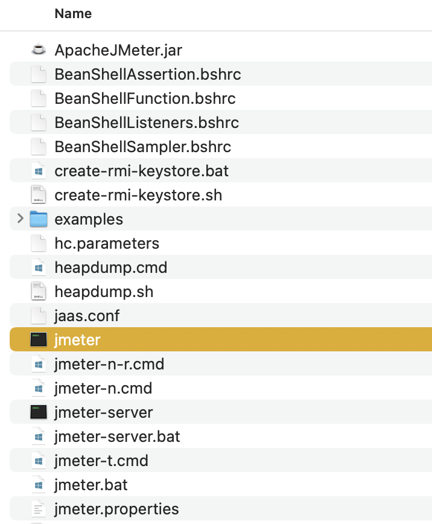

# JMeter

## What is JMeter?
Apache JMeter is a popular open-source tool for load testing and performance testing of web applications, web services, and other resources. 

## How to install JMeter?

**Prerequisites**
* Java: JMeter is a Java application. Make sure you have Java 8 or later installed. You can check by running the following in your Terminal:
```sh
java -version 
```
If Java's not installed, download it from the [official site](https://www.java.com/en/download/)

**Steps:**
1. Navigate to https://jmeter.apache.org/download_jmeter.cgi
2. Download binaries for your operating system.
3. Extract the downloaded archive to a suitable location.

## Running JMeter
1. Navigate to JMeter's 'bin' Directory: Use the `cd` command to change into the 'bin' directory of your JMeter installation. For example:
```sh
cd /Users/yourusername/Downloads/apache-jmeter-5.5/bin  
```
Note: Adjust the path if you extracted JMeter to a different location.

2. Launch JMeter GUI: Execute the following command:
```js
./jmeter 
```
This will launch the JMeter graphical user interface.



## Recording your first script
1. Right click Test Plan -> Add -> Non-Test Elements -> HTTP(S) Test Script Recorder


2. Under Test Plan Creation tab, select Target Controller as shown below:

3. Under Request Filtering -> URL Patterns to exclude, mention the patterns you would like to exclude during load testing.
To exclude unnecessary calls such as image calls and focus on capturing service request and response in JMeter, you can specify URL patterns to exclude under the "URL Patterns to Exclude" section in the request filtering tab. Here are some common patterns you can use to exclude image calls and other non-service-related requests:

1. **Exclude Image Calls:**
   - `.*\.jpg`
   - `.*\.jpeg`
   - `.*\.png`
   - `.*\.gif`
   - `.*\.bmp`
   - `.*\.ico`

2. **Exclude CSS and JavaScript Files:**
   - `.*\.css`
   - `.*\.js`

3. **Exclude Font Files:**
   - `.*\.woff`
   - `.*\.woff2`
   - `.*\.ttf`
   - `.*\.otf`

4. **Exclude Other File Types:**
   - `.*\.pdf` (PDF files)
   - `.*\.doc` (Word documents)
   - `.*\.xls` (Excel spreadsheets)
   - `.*\.zip` (ZIP archives)
   - `.*\.mp3` (Audio files)
   - `.*\.mp4` (Video files)

You can combine these patterns using the logical OR (`|`) operator if you want to exclude multiple file types. For example:
```
.*\.jpg|.*\.jpeg|.*\.png|.*\.gif|.*\.bmp|.*\.ico|.*\.css|.*\.js|.*\.woff|.*\.woff2|.*\.ttf|.*\.otf|.*\.pdf|.*\.doc|.*\.xls|.*\.zip|.*\.mp3|.*\.mp4
```

Make sure to adjust these patterns based on the specific file types or URLs that you want to exclude in your JMeter test. This will help you focus on capturing the service-related requests and responses while ignoring unnecessary calls like image downloads.


4. Prepare Firefox by setting up a proxy for your browser: Go to firefox settings -> Manage more settings; General -> Networking -> Settings -> Select Manual Proxy Configuration. The port number should match with the port number mentioned in JMeter.


5. Go back to JMeter and click start. A Root CA certificate ApacheJMeterTemporaryRootCA will be created in JMeter bin directory.
6. Once root certificate is generated, go back to Firefox settings and search for 'certificate'.
7. Under `Authorities` tab, click import. Select the certificate from the JMeter -> bin folder, give access and click ok. 


8. Go back to Jmeter and click the start button again. Click Ok on certificate info dialog. A recorder transaction control window will open. Keep it running, go to Firefox and navigate to your desired site. Perform some actions & then stop recording. I have navigated to `(https://blazedemo.com/`.
9. All network traffic will be recorded under HTTP(S) Test Script Recorder. You can browse through these recorded calls and see the details. Don't forget to save your project.


10. Once your testing is done, don't forget to change the browser settings back to normal, otherwise you won't be able to browse normally.


## Recording using Blazemeter chrome plugin
The BlazeMeter Chrome Extension is a free tool that enables you to Record, Upload, and Run test scripts for your web applications.
Link: https://chromewebstore.google.com/detail/blazemeter-the-continuous/mbopgmdnpcbohhpnfglgohlbhfongabi
More Details: https://help.blazemeter.com/docs/guide/recorders-blazemeter-chrome-extension.html

### Steps:
1. Download Blazemeter chrome plugin.
2. When you run the plugin for the first time, you'll need to signup & create an account on the [Blazemeter site](https://a.blazemeter.com/).

3. Click on Start button. Navigate to your desired site. Perform required actions. Stop recoding & export the recording as JMX file.
4. Import the `.jmx` file into the Jmeter. (File -> Open -> select the downloaded `jmx` file. It will open up in your JMeter.


## Working with thread group to apply load

### What is thread group?

In JMeter, a Thread Group is a fundamental element used to define the characteristics of virtual users (threads) that will simulate concurrent users accessing your application or system during a performance test. The Thread Group is where you specify settings such as the number of threads (users), ramp-up period, loop count, and test duration. Here are the key components of a Thread Group in JMeter:

1. **Number of Threads (Users):** This parameter defines how many virtual users (threads) will be created to simulate concurrent users accessing your application. Each thread represents a user making requests to the server.

2. **Ramp-Up Period:** The ramp-up period specifies the time it takes to gradually increase the number of threads from 0 to the specified number of threads. For example, if you have 100 threads and a ramp-up period of 10 seconds, JMeter will start 10 threads per second until all 100 threads are active.

3. **Loop Count:** The loop count determines how many times each thread (user) will execute the test plan. For example, if you set the loop count to 5, each user will execute the test plan 5 times before ending the test.

4. **Duration (Seconds):** Instead of specifying a loop count, you can set the duration of the test in seconds. JMeter will continue running the test until the specified duration is reached, regardless of the number of loops completed by each thread.

5. **Scheduler:** The Thread Group also allows you to configure a scheduler to specify the start and end times of the test. This is useful for running tests at specific times or for a specific duration during non-business hours, for example.

6. **Action to be taken after a Sampler Error:** You can configure the Thread Group to define what action should be taken if an error occurs during the execution of a sampler (request). Options include stopping the thread, stopping the test, stopping the test after a certain number of errors, or continuing the test.

7. **Listeners:** Within the Thread Group, you can add listeners to collect and analyze the test results. Listeners provide various types of reports, graphs, and metrics to help you assess the performance of your application under load.

Overall, the Thread Group is a crucial component in JMeter for configuring and controlling the behavior of virtual users during performance tests, allowing you to simulate realistic user loads and analyze the performance of your application or system under different scenarios.

### Adding thread group
1. Right click on test plan -> Add -> Threads (Users) -> Thread Group


### Applying Load
1. Add details about your desired load.
2. If your calls are still under recording folder, move all the request/calls under Thread group.


## Working with Listeners to check outputs:

### What are Listeners?
In JMeter, listeners are components that capture and display the results of performance tests. They provide various types of reports, graphs, and metrics that help you analyze the behavior and performance of your application or system under load. Listeners play a crucial role in performance testing as they allow you to monitor and interpret the test results effectively. Here are some common listeners in JMeter:

1. **View Results Tree:** This listener displays the detailed results of each sample (request) executed during the test. It provides information such as response time, response data, request URL, status code, and more. The View Results Tree listener is useful for debugging and analyzing individual requests.

2. **Summary Report:** The Summary Report listener provides a summary of key performance metrics for all samples in the test plan. It includes metrics such as average response time, throughput (requests per second), error rate, minimum and maximum response times, and standard deviation. The summary report gives you an overview of the test performance at a glance.

3. **Aggregate Report:** The Aggregate Report listener aggregates and displays performance metrics in a tabular format. It shows metrics like average response time, median, 90th percentile, error count, throughput, and more for each sampler (request) in the test plan. The aggregate report helps in analyzing performance trends and identifying bottlenecks.

4. **Graphs:** JMeter provides various graphical listeners such as the Response Times Over Time graph, Active Threads Over Time graph, Bytes Throughput Over Time graph, and more. These graphs visualize performance metrics over time, helping you identify trends, spikes, and patterns in the test results.

5. **View Results in Table:** The View Results in Table listener presents the test results in a tabular format, similar to a spreadsheet. It includes columns for sample name, sample time, latency, response code, response message, and more, making it easy to view and analyze large amounts of data.

6. **Aggregate Graph:** The Aggregate Graph listener displays performance metrics in a graphical format, allowing you to visualize metrics such as response times, throughput, and error rate for each sampler in the test plan. The aggregate graph helps in understanding the distribution and performance of requests.

7. **Response Assertion:** While not a traditional listener, the Response Assertion component allows you to add assertions to your test plan to validate the response of samplers (requests). Assertions check if certain conditions are met in the response, such as response code, response data, or response time, and mark the sample as either pass or fail based on the assertion criteria.

These are some of the commonly used listeners in JMeter, and they provide valuable insights into the performance of your application or system during load testing. Depending on your testing requirements and analysis needs, you can use one or more listeners to monitor and interpret the test results effectively.

# Resources:
* Udemy: https://www.udemy.com/course/learn-jmeter-from-scratch-performance-load-testing-tool/learn/lecture/8237592#overview
* Site: https://www.blazemeter.com/university