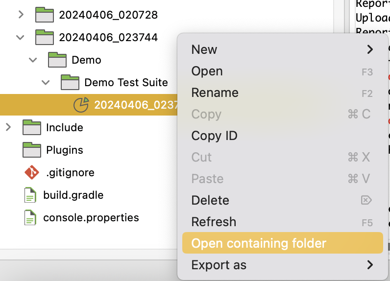

# Katalon Studio

* Katalon Studio uses Selenium libraries for Web Testing.
* Supports Web UI, Mobile, API, Desktop & BDD.
* 3 Ways to create tests (These can be used in combination too)
  1. Record Mode
  2. Manual Mode 
  3. Script Mode
* Groovy is the scripting language used in the Script Editor.
* Anything created in Manual mode is reflected in Script mode and vice versa.
* Command line users can run Test Suite and Test Suite Collections (but not the test case).
* `Ctrl+Shift+O` is the keyboard shortcut to resolve imports in script editor. This will add required imports and remove unnecessary imports.
* `WebUI` is the class/package name that contains all keyword action methods.
* `findTestObject('{Object ID}')` is the syntax to refer an Object in script view. 
  
# Installation
Step 1: Download Katalon Studio from https://katalon.com/  
Step 2: Create Katalon Studio account & sign-in.


# Test Creation in Record Mode
Step 1: Create a blank project  


Step 2: Recording
1. Start recording your first test by providing a URL.


1. Once done, stop recording & Save Script.  


3. Click 'OK' on the `Add Element to Object Repository` window.


4. On the 'New' Test Case window, enter a name for your test and click OK.


5. Check project content from the left navigation menu.


6. Run your test.


You can also check the generated test script by clicking on the `</> Script` tab from the tab list shown on the bottom right pane.


# Test Creation in Manual Mode

Step 1: Create a new test case  
Step 2: Spy the required objects  
On the main toolbar, click on Spy Web icon.  Provide the URL (we are using [OrangeHRM](https://opensource-demo.orangehrmlive.com/) Demo site) and spy all the required objects for the test case & save in the repository.


Step 3: Add the keywords in the test case  
1. Click Add icon


2. Select the required action & provide the input value.


  3. Drag the additional objects from the object repository & provide the required values for the action.


4. Run the test


# Test Creation in Script Mode
Step 1: Create a new test case  
Step 2: Spy the required objects  
On the main toolbar, click on Spy Web icon.  Provide the URL (we are using [OrangeHRM](https://opensource-demo.orangehrmlive.com/) Demo site) and spy all the required objects for the test case & save in the repository.  
Step 3: Goto the script view of the test case
Step 4: Create scripts for the test steps.   
Note: You can also drag and drop objects from Object Repository folder into the script editor


```groovy
WebUI.openBrowser("")
WebUI.navigateToUrl("https://opensource-demo.orangehrmlive.com/")
WebUI.setText(findTestObject('Object Repository/Page_OrangeHRM/input_Username_username'), "Admin")
WebUI.setEncryptedText(findTestObject('Object Repository/Page_OrangeHRM/input_Password_password'), "hUKwJTbofgPU9eVlw/CnDQ==")
WebUI.click(findTestObject('Object Repository/Page_OrangeHRM/button_Login'))
WebUI.verifyTextPresent("Dashboard", false)
WebUI.closeBrowser()
```

Step 5: Run the test


# Working With Test Suites
Test Suite = collection of test cases
Step 1 : Create a new Test Suite
Step 2 : Add test cases
Step 3 : Update Execution Information section if needed
Step 4 : Save & Run


**What is a Test Suite?**

* **Collection of Test Cases:** A Test Suite is a fundamental way to group and organize your test cases in Katalon Studio.  It allows you to create a structured execution plan for your tests.
* **Logical Grouping:**  Test Suites let you group test cases that share a common goal, theme, or area of functionality. For example:
    * **Regression Test Suite:**  A suite focused on testing core features after code changes.
    * **Smoke Test Suite:** A suite containing a small set of critical tests for a quick check.
    * **Feature-Specific Test Suite:** A suite dedicated to testing a particular application function.
* **Requirements Coverage:** You can design Test Suites to map to specific requirements, ensuring your tests cover all essential aspects of your application.

**Key Benefits of Using Test Suites**

1. **Organization:** Keep your tests structured and easier to manage as your project grows.
2. **Selective Execution:** Run specific groups of tests as needed (e.g., smoke tests, regression tests). This saves time and lets you focus on targeted areas.
3. **Reusability:** A test case can belong to multiple Test Suites, allowing efficient reuse of test logic.
4. **Reporting:** Get consolidated reports for all the test cases run within a Test Suite.

**How to Create a Test Suite in Katalon Studio**

1. In the **Tests Explorer** section, right-click the "Test Suites" folder.
2. Choose "New Test Suite".
3. Name the Test Suite descriptively. 
4. Add test cases by dragging them into your new Test Suite or using the "Add Test Case" option in the toolbar.

**Additional Notes:**

* **Test Suite Collections:**  You can create Test Suite Collections, which are groups of Test Suites. This is useful for running a large number of tests in a defined sequence or in parallel.

Step 1 : Create a Test Suite Collection
Step 2 : Add Test Suites
Step 3 : Update Execution Information Section
Step 4 : Save & Run

Note: 
* Parallel execution is available in Test Suite Collection and not Test Suite.
* Users can select the browser for every Test Suite added in Test Suite Collection.
* If required users can set different timeout for every test suite
  
* **Dynamic Test Suites:** These suites use search queries to add test cases automatically. This makes them adaptable to changes in your test case library.


# Logs & Reports
* Reports are generated for Test Suite and Test Suite Collection execution

To see the reports, install the free plugin:





# Screen Shots & Video Recording
Katalon Studio offers two types of video recording:

**1. Screen-based Video Recording**

* Records your entire screen during test execution.
* Ideal for demonstrating test case flows visually.

**To enable screen-based recording (Katalon Studio version 7.8.0 and later):**

1. **Project Settings:** Navigate to **Project > Settings > Execution**.
2. **Video Recorder:** Check the box "Record video during execution".
3. **Select Recorder:** Choose "Screen Recorder".
4. **Configure:**  
   * **Video Format:** Select AVI (.avi) or MOV (.mov). AVI is recommended for smaller file sizes.
   * **Video Quality:**  Choose Low, Medium, or High.  Start with Low to minimize file sizes.
5. **Apply and Close:** Click the "Apply and Close" button.

**2. Browser-based Video Recording**

* Records activity specifically within the web browser during execution.
* Useful for debugging web-based UI tests.

**To enable browser-based recording:**

1. **Project Settings:**  Go to **Project > Settings > Execution**.
2. **Video Recorder:** Check the box "Record video during execution".
3. **Select Recorder:** Choose "Browser-based Recorder".
4. **Desired Capabilities:** 
   * Navigate to **Desired Capabilities > WebUI** 
   *  Select your target browser (Chrome, Chrome Headless, or Edge Chromium).
   *  Click "Add" and add a name/value pair to set desired browser properties (refer to Katalon docs for details).
5. **Apply and Close:** Click the "Apply and Close" button.

**Important Notes:**

* **FFmpeg:** For browser-based recording, you will need to install FFmpeg (a free video processing tool). Katalon Studio can guide you through the installation process if needed.
* **Video Locations:** Recorded videos are stored within the test suite results in your Reports folder.

**Additional Tips:**

* Start with low-quality videos to conserve disk space, especially for longer test suites.
* By default, Katalon Studio only records videos for failed test cases. You can modify these settings in Project Settings.

# Email Notifications:


# Resources:
## Official Site:
* https://katalon.com/
* https://store.katalon.com/
## Demo Sites:
* http://demoaut.katalon.com/
* https://opensource-demo.orangehrmlive.com/
  
  