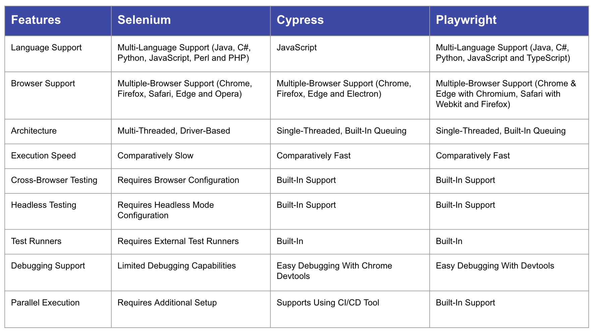
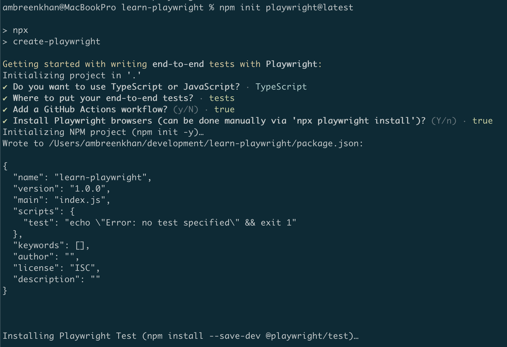
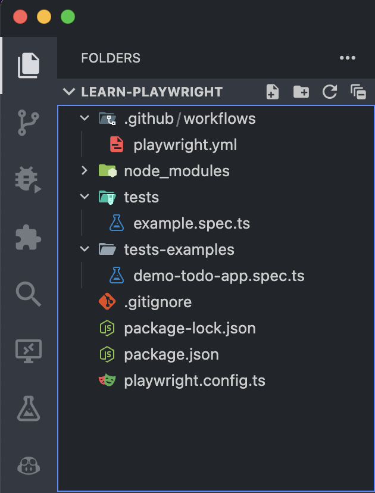
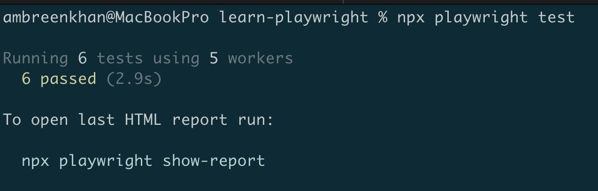
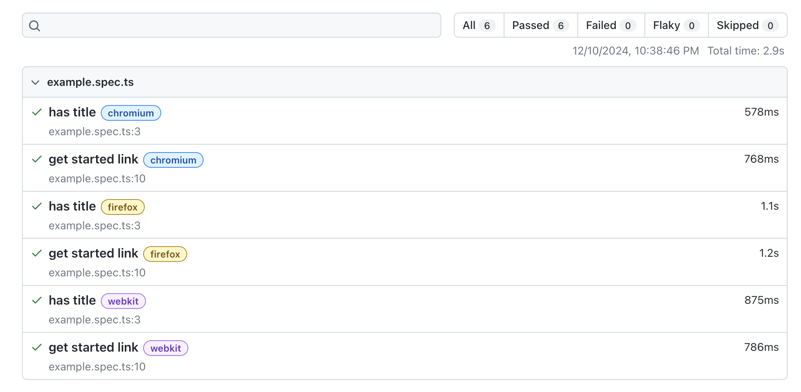

# Playwright 

## 1. Introduction  
In the rapidly changing landscape of web application development, testing has become more complex and critical than ever. Modern web applications demand robust, flexible, and efficient testing frameworks that can keep pace with emerging technologies and diverse browser ecosystems. 

Playwright, an open-source framework developed by Microsoft, is designed to address the challenges of testing modern web applications. It offers robust support for cross-browser testing, mobile device emulation, and end-to-end automation. Its rich set of features, like automatic waiting, test isolation, and debugging tools, make it a top contender for building scalable and reliable test frameworks.

In this blog, we’ll focus on getting started with Playwright and explore the essential best practices for writing effective and reliable test scripts. Whether you’re new to test automation or transitioning to Playwright, this guide will help you set a strong foundation. Let’s get started!

## 2. Why Choose Playwright for Test Automation?  
To answer this question, let's take a step back and look at the current landscape of web testing tools.: **Selenium**, **Cypress**, and **Playwright**.  

### Selenium 
Selenium is a pioneer in web app testing and has been widely used for years. It's known for its versatility, supporting a range of tools such as Selenium Grid, Selenium IDE, Selenium RC, and Selenium WebDriver. Selenium works with several programming languages, including Java, JavaScript, C#, and Python. However, it can be complex to set up and manage, especially when dealing with advanced browser features or ensuring stable parallel test execution.  

### Cypress  
Cypress is an open-source, JavaScript-based E2E testing framework that provides a fast and developer-friendly experience. Its unique features include real-time reloading, time-travel debugging, and automatic waiting, making it a favorite among front-end developers.  
Cypress supports testing across multiple browsers, including **Chrome-family browsers, Firefox, and WebKit (Safari's browser engine)**, enhancing its cross-browser compatibility. However, Cypress runs tests in the same execution loop as the application, which may limit flexibility for some advanced use cases, such as running tests entirely outside the browser.  

### Playwright  
Playwright is a relatively new tool that has quickly gained popularity due to its comprehensive capabilities. It supports three major browser engines—**Chromium, Firefox, and WebKit**—ensuring full cross-browser compatibility. Playwright also supports multiple programming languages, including JavaScript/TypeScript, Python, Java, and .NET, making it versatile for diverse teams.  

**Here’s why Playwright stands out:**  

- **Cross-Browser and Device Support:** Playwright ensures seamless cross-browser testing across Chromium, Firefox, and WebKit, including mobile device emulation for testing web apps on various devices.  

- **Automatic Waiting and Resilient Testing:** With Playwright, there’s no need to add manual waits. It automatically waits for elements to be ready and provides features like network interception and retries for flaky assertions, ensuring stable and reliable tests.  

- **Parallel Execution and Test Isolation:** Each test in Playwright runs in a separate **BrowserContext**, offering complete test isolation. This enables parallel execution without interference, saving time and improving test reliability.  

- **Developer Experience:** Playwright is designed with developers in mind, offering tools like screenshots, video recording, and tracing to simplify debugging. It also supports flexible configurations and integrates well with CI/CD pipelines for smooth deployments. 

 

Playwright combines the strengths of Selenium and Cypress while addressing their limitations, making it an excellent choice for modern web applications. It’s especially valuable for teams looking to create scalable, reliable, and developer-friendly automation frameworks.  

## 3. Getting Started: Playwright Setup 
Getting started with Playwright is straightforward. This section will walk you through the basic setup and installation to get your first Playwright project up and running.  

### Prerequisites  

Before installing Playwright, make sure the following are already installed on your system: 
* [Node](https://nodejs.org/en)
* [VS Code](https://code.visualstudio.com/) (or any code editor of your choice) 
* [Playwright extension (Microsoft)](https://marketplace.visualstudio.com/items?itemName=ms-playwright.playwright)

### Installation Steps  

1. Create a new project directory:
```bash  
mkdir learn-playwright  
cd learn-playwright  
```  

2. Initialize Playwright in the project folder:  
```bash  
npm init playwright@latest  
``` 

3. Follow the prompts in the terminal to configure your Playwright setup. It will automatically install the necessary dependencies and set up the default folder structure.  



### Project Structure

Once the installation is complete, your project will include the following files and folders:  

- **`playwright.config.ts`**  
  The Playwright Test Configuration file. Use this file to define browser options, test directory, and other settings.  

- **`.github/workflows/playwright.yml`**  
  A GitHub Action workflow file for automating tests in CI/CD pipelines.  

- **`tests/`**  
  The default top-level folder where Playwright looks recursively for test files.  

- **`tests-examples/`**  
  A folder containing example tests, including a demo script for testing a "To-Do" app.  

- **`package.json`**  
  The npm project file that includes all dependencies and scripts for running Playwright tests. 

   

You’re now ready to dive into writing and running Playwright tests!  

Inside that directory, you can run several commands:

* Run the end-to-end tests:
`npx playwright test`

* Start the interactive UI mode:
`npx playwright test --ui`

* Run the tests on Desktop Chrome:
`npx playwright test --project=chromium`

* Runs the tests from a specific file: 
`npx playwright test example`

* Run the tests in debug mode:
`npx playwright test --debug`
    
* Auto generate tests with Codegen
`npx playwright codegen <web-url>`

Let's try running your first tests by using the command `npx playwright test`:



By default, Playwright generates HTML reports. You can view the execution report by running: `npx playwright show-report`.


   
## 4. Core Architectural Concepts
At its core, Playwright introduces several key abstractions that enable developers to write comprehensive and reliable browser automation scripts. To get the most out of Playwright, it's important to understand the key concepts that form the foundation of the tool: Browsers, Contexts, Pages, and Selectors. Let’s break them down:

### 1. Browsers
A `Browser` represents an instance of a browser (Chromium, Firefox, or WebKit). Playwright allows you to launch and manage browser instances programmatically.

```javascript
import { chromium } from '@playwright/test';
const browser = await chromium.launch();
```

### 2. Browser Contexts
A `BrowserContext` is an isolated environment within a browser, similar to a new incognito window. Each context has its own cookies, cache, and settings, enabling parallel and independent test scenarios.

```javascript
const context = await browser.newContext();
```

### 3. Pages
A `Page` represents a browser tab. It’s where the action happens—interacting with the page, performing tests, and taking screenshots or videos. Every test interacts with pages to perform user-like actions.

```javascript
const page = await context.newPage();
await page.goto('https://example.com');
```

### 4. Selectors
Selectors in Playwright are powerful mechanisms for locating and interacting with elements on a web page. Playwright supports multiple selector engines, including CSS, XPath, and its own text and role-based selectors. 

#### Common Selectors
* By Id: `page.locator('#inputEmail')`
* By Class value: `page.locator('.heading')`
* By Attribute: `page.locator('[placeholder="Email"]')`
* By Tag name: `page.locator('input')`
* By Class value (full): `page.locator('[class="input-field size-medium"]')`
* Combine different selectors: `page.locator('input[placeholder="Email"][nbinput]')`
* By XPath (Not recommended): `page.locator('//*[@id="firstName"]')`
* By partial text match: `page.locator(':text("Consent")')`
* By exact text match: `page.locator(':text-is("User Consent")')`

#### User Facing Selectors
* Get by role: `page.getByRole('button', { name: 'Create Account' })`
* Get by label: `page.getByLabel('first name')`
* Get by placeholder: `page.getByPlaceholder('first name')`
* Get by text: `page.getByText('Create SCLA Account')`
* Get by title: `page.getByTitle('Create SCLA Account')`

### Example Code Snippet: Putting It All Together

Here's a simple example demonstrating the relationships between Browsers, Contexts, Pages, and Selectors:

```javascript
import { chromium, Browser, Page } from '@playwright/test';

(async () => {
  // Launch a new browser instance
  const browser: Browser = await chromium.launch({ headless: true });

  // Create a new browser context
  const context = await browser.newContext();

  // Create a new page
  const page: Page = await context.newPage();

  // Navigate to the website
  await page.goto('https://example.com');

  // Define locators
  const usernameInput = page.getByRole('textbox', { name: 'Username' });
  const passwordInput = page.getByRole('textbox', { name: 'Password' });
  const loginButton = page.getByRole('button', { name: 'Login' });

  // Interact with elements
  await usernameInput.fill('testuser');
  await passwordInput.fill('password123');
  await loginButton.click();

  // Wait for navigation or a specific element after login
  await page.waitForURL('**/dashboard'); 
  // Or use a specific post-login locator:
  // await page.getByRole('heading', { name: 'Welcome' }).isVisible();

  // Take a screenshot
  await page.screenshot({ path: 'screenshot.png' });

  // Close the browser
  await browser.close();
})();

```
### Best Practices
- **Test user-visible behavior**: Focus on verifying the user-visible behavior of the application and avoid testing implementation details.
- **Test Isolation:** Each test should be completely isolated from another test.
- **Locators:** Use locators that are resilient to changes in the DOM such as `page.getByRole` instead of XPath or CSS selectors.
- **DRY Principle** (Don't Repeat Yourself): If multiple methods share duplicate code, refactor them into a single generic method that accepts parameters to manage the variations. You can refactor this by creating a generic method that accepts parameters to handle the variations.
- **Error Handling:** Add error handling to manage unexpected issues, such as missing elements.
- **Code Readability:** Enhance the readability by using descriptive variable names and structuring the code more clearly.
- **Use web first assertions:** By using web first assertions Playwright will wait until the expected condition is met.
  - Example: `await expect(page.getByText('welcome')).toBeVisible();`
- **Do not use manual assertion:** Don't use manual assertions that are not awaiting the expect. 
  - Example: `expect(await page.getByText('welcome').isVisible()).toBe(true);`
- **Keep your Playwright dependency up to date:** This is allow you to test your app on the latest browser versions.
- **Lint your tests:** Linting the tests helps catching errors early. 

Playwright represents more than just a testing tool—it's a comprehensive solution for ensuring web application quality. By addressing the limitations of previous frameworks and introducing intelligent automation features, it empowers development teams to build more reliable, efficient test suites.
As web technologies continue to evolve, tools like Playwright will be crucial in maintaining high-quality, performant web applications across diverse platforms and devices.

Ready to revolutionize your testing strategy? Start your Playwright journey today!
  


