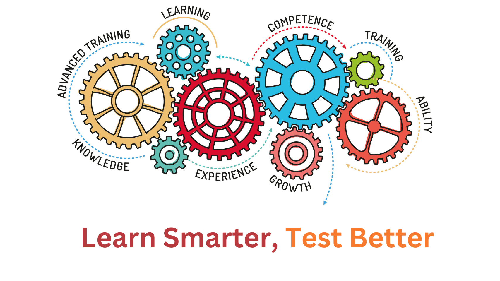

Software Testing is an integral part of software development. We are living in an age where technology is changing very fast. All this change is great but it makes it challenging for testing professionals to test the application thoroughly. We continuously need to learn new skills to keep us abreast.

BUT…**if you are enthusiastic about learning, you can turn this challenge into an opportunity**. Your each challenge will result into new skill set and will provide you a sense of achievement.

I am also passionate about new technological changes and love to explore and then share this knowledge. So, on my site, you'll find….

* Useful tools to make your testing task enjoyable and super easy.
* Best practices you can follow & also inspire others to create a culture of quality.
* Tips & Tricks you can use and make your testing journey worthwhile.
* How to's – Practical guides about testing activities.

I wish you all the best in your journey to explore and use the available resources to become an exceptional testing professional.

> “We are what we repeatedly do. Excellence, then, is not an act, but a habit” - Aristotle

I would love to hear any suggestions/feedback from you...Also let me know if you have some knowledge that you want to share with all of us. Stay Connected!

Thanks,  
Ambreen Khan.
